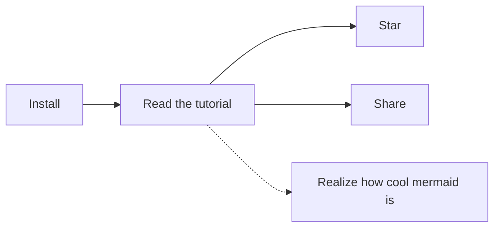

# Notale Guide

# 01 - The Data Directory

The data directory is where all your notes and attachments will be stored, it has the following structure:

```
/path/to/your/data_directory
├─┬ attachments
│ ├── foo.ext
│ ├── bar.ext
│ └── …
└─┬ notes
  ├── foo.md
  ├── bar.md
  └── …
```

## Features

- The data directory gives you freedom since your notes are never locked into some sort of proprietary database, all your files use sane formats and are easily accessible and portable.
- You can open your data directory via `Notable -> Open Data Directory`.
- You can also change data directory at any time via `Notable -> Change Data Directory...`, the current content won't be copied over to the new one.
- You can edit your notes/attachments without even using Notable, all changes you make to them will be reflected here instantly. In fact you could also import a Markdown note simply by copying it into the `notes` directory.

## Advanced Features

The data directory allows you to leverage third-party tools to have powerful features like synchronization, versioning and encryption, we'll talk about those in the [advanced](@tag/Advanced) sections.


# 02 - The Sidebar

The sidebar is where all your notes are categorized.

## Categories

- **All Notes**: This section contains all notes.
- **Favorites**: This section contains all notes you've favorited.
- **Notebooks**: This section contains all notes tagged with the special `Notebooks/*` tag.
- **Tags**: This section contains all notes tagged with any tag except the special ones: `Notebooks/*` and `Templates/*`.
- **Templates**: This section contains all notes tagged with the special `Templates/*` tag. These notes won't be displayed in any other category.
- **Untagged**: This section contains all notes that have no tags.
- **Trash**: This section contains all notes that have been deleted. These notes won't be displayed in any other category.

You can create sub-categories in the following sections: Notebooks, Tags and Templates by using nested tags.


# 03 - The Middlebar

The middlebar shows you all notes contained in the currently active category, properly ordered and filtered by the search query.

## Search

To search just type something in the search bar.

The title of notes is searched in _fuzzily_, which basically means that you can omit some characters from the query: if for instance there's a note titled "Notable" you can also find it by typing "Noab" or "Notae", as long as the characters are in the right order the note will be found.

The content of notes is searched in too, but not fuzzily, a full-match is required in this case.

## New Note Button

Next to the search bar there's also a button for creating a new note.

## Sorting Order

Right below the search bar you can change the order in which notes are being displayed.

By default this is by `Title - Ascending`, so that the tutorial notes get displayed in order, but you might want to change this later to `Date Modified - Descending`, so that the most recently edited notes are at the top.

## Notes

Lastly there's the notes list.

Notes will have some badges if they are pinned, favorited or have attachments.

Pinned notes are displayed before the others.

If you right-click them you can access some commands, all of them are also available from the app menu, most of them are also available from the mainbar's toolbar.


# 04 - The Mainbar

The mainbar is where you can preview and edit the currently active note.

## Toolbar

The toolbar contains buttons for triggering actions to the current note, all of them are also accessible via shortcuts.

## Preview/Editor/Multi-Editor

Right below the toolbar there's the preview/editor/multi-editor area.

#### Preview

Rendered notes are displayed here.

#### Editor

When editing you'll use [Monaco Editor](https://github.com/Microsoft/monaco-editor), the same editor VS Code uses, which comes with features like multi-cursor built-in. Read about the shortcuts this editor supports in the [Shortcuts](@note/07 - Shortcuts.md) tutorial note.

In case the built-in editor doesn't cut it  there's also a button in the toolbar for opening the current note in the default Markdown editor. We just can't include into Notable all features and nice plugins you might have in your default editor.

#### Multi-Editor

When 2 or more notes are selected a multi-note editor will be displayed in the mainbar, read more about this [here](@note/09 - Multi-Note Editing.md).


# 05 - Notes

## Syntax

Notes are written in [GitHub-Flavored Markdown](https://guides.github.com/features/mastering-markdown), so you can write emojis (`:joy:` -> :joy:), ~~strikethrough~~ text etc. in a familiar fashion, additionally you can also write subscripts~example~, superscripts^example^ and footnotes[^1].

[^1]: This is a footnote, you don't need to manually write it at the bottom of the document.

This also means that your notes aren't locked into any proprietary format.

Notes can have some metadata: if they are favorited or not, which tags they have, which attachments they have, etc. These metadata are written as Markdown front matter. This is taken care of for you.

## Syntax Plugins

Some syntax plugins for providing you [KaTeX](https://katex.org), [AsciiMath](http://asciimath.org) and [mermaid](https://github.com/knsv/mermaid) support are built-in, check out this note's source.

#### KaTeX

Wrap a formula in `$$` to display it as a block:

$$f{x} = \int_{-\infty}^\infty \hat f\xi\,e^{2 \pi i \xi x} \,d\xi$$

Multi-line block formulas are supported too:

$$
\begin{pmatrix}
   f(\alpha) & b        & c         \\
   e         & f(\beta) & g         \\
   i         & j        & f(\gamma)
\end{pmatrix}
$$

Wrap it in `$` to display it inline: $e^{iπ} + 1 = 0$.

The [mhchem](https://mhchem.github.io/MathJax-mhchem) syntax for writing chemical expressions is supported too:

$$\ce{ SO4^2- + Ba^2+ -> BaSO4 v }$$

> **Note**: In order to minimize conflicts there mustn't be spaces at the beginning and end of a single-line formula, and the ending `$` character musn't be followed by a digit. If you need to you can escape the `$` character with a backslash.

> **Note**: If your formula contains a `$`, you will have to wrap it in either double `$$` or a code block in order to avoid clonflicts.

#### AsciiMath
Wrap a formula in `&&` to display it as a block:

&&sum_(i=1)^n i^3=((n(n+1))/2)^2&&

Wrap it in `&` to display it inline: &e = mc^2&.

> **Note**: In order to minimize conflicts there mustn't be spaces at the beginning and end of a formula, and the ending `&` character musn't be followed by a digit. If you need to you can escape the `&` character with a backslash.

#### mermaid



#### `<markdown>` Tag

Notable supports a custom `<markdown>` HTML tag. Anything written inside it will be rendered as Markdown. This is particularly useful when you have to write raw HTML but you still want to write Markdown inside it, like when using the `<details>` tag or when writing tables with multi-line content inside cells.

<details>
  <summary>Click to show more...</summary>
  <markdown>
- Embedded
  - _Markdown_
  </markdown>
</details>

## Attachments

Notes can have attachments, because sooner or later you'll want to save a file in a note, be it a boarding pass for your next trip or something else.

Attachments can be added by clicking the attachment icon in the mainbar's toolbar. Attachments are simply copied into your data directory, under the `attachments` sub-directory.

You can open/remove them at any time.


# 06 - Tags

Notes can have multiple tags, which are useful for better categorization.

## Syntax

- **Root**: Root tags don't contain any forward slash (`/`). If there are any notebooks or templates defined they will be rendered inside the special `Tags` section in the sidebar, otherwise the `Tags` parent section will be omitted.

- **Nested**: Tags can also be nested, _indefinitely_, just write them like a path, separating the levels with a forward slash: `foo/bar/baz`.

## Special Tags

- **Notebooks**: You've probably noticed that Notable supports notebooks too. To create one just add a tag starting with `Notebooks/` to a note. 

- **Templates**: Notable also supports Templates, to create one just add the `Templates` tag to a note. Of course nesting is supported here too, i.e. `Templates/Work`.

Feel free to use these features, if you don't need them their icons won't be displayed in the sidebar.

## Collapse/Expand

Tags with children can be collapsed/expanded, just right-click them and select the option or double-click them.

## Editing

There are multiple ways to add/remove tags:

- **Single-note editing**: There's a button in the toolbar for editing a note's tags.
- **Multi-note editing**: Tags can be added/removed from multiple notes at once via the [multi-note editing](@note/09 - Multi-Note Editing.md) features provided.
- **Advanced search & replace**: Alternatively you could just open your data directory with your editor and perform a search & replace there, this way you can also use advanced features like regexes.


# 07 - Shortcuts

> An OS-specific version of this document is available via the `Help -> View Shortcuts` menu item.

The following are macOS shortcuts, if you're using a different OS replace <kbd>Cmd</kbd> with <kbd>Ctrl</kbd>, or <kbd>Alt</kbd> if <kbd>Ctrl</kbd> is already used.

## Note

- <kbd>Cmd+N</kbd> - New.
- <kbd>Cmd+Alt+Shift+N</kbd> - New from Template.
- <kbd>Cmd+Shift+N</kbd> - Duplicate.
- <kbd>Cmd+O</kbd> - Quick open.
- <kbd>Cmd+P</kbd> - Quick open.
- <kbd>Cmd+Alt+O</kbd> - Open in default app.
- <kbd>Cmd+Alt+R</kbd> - Reveal in Finder/Folder.
- <kbd>Cmd+E</kbd> - Toggle editing.
- <kbd>Cmd+Shift+E</kbd> - Toggle editing.
- <kbd>Cmd+Shift+T</kbd> - Toggle tags editing.
- <kbd>Cmd+Shift+A</kbd> - Toggle attachments editing.
- <kbd>Cmd+D</kbd> - Toggle favorite.
- <kbd>Cmd+Shift+D</kbd> - Toggle pin.
- <kbd>Cmd+Backspace</kbd> - Move to trash, when previewing.
- <kbd>Delete</kbd> - Move to trash, when previewing.
- <kbd>Cmd+Alt+Backspace</kbd> - Move to trash, when editing.
- <kbd>Cmd+Shift+Backspace</kbd> - Restore from trash.
- <kbd>Shift+Delete</kbd> - Restore from trash.
- <kbd>Cmd+Alt+Shift+Backspace</kbd> - Permanently Delete.
- <kbd>Ctrl+Delete</kbd> - Permanently Delete.

## Editor

- <kbd>Cmd+Z</kbd> - Undo.
- <kbd>Cmd+Shift+Z</kbd> - Redo.
- <kbd>Alt+Click</kbd> - Insert a new cursor.
- <kbd>Cmd+Enter</kbd> - Insert a new line below the current one.
- <kbd>Cmd+Shift+Enter</kbd> - Insert a new line above the current one.
- <kbd>Cmd+Alt+Up</kbd> - Insert a new cursor above.
- <kbd>Cmd+Alt+Down</kbd> - Insert a new cursor below.
- <kbd>Cmd+Ctrl+Up</kbd> - Move current line above.
- <kbd>Cmd+Ctrl+Down</kbd> - Move current line below.
- <kbd>Cmd+D</kbd> - Select the next match.
- <kbd>Cmd+Shift+L</kbd> - Select all matches.
- <kbd>Alt-Z</kbd> - Toggle word wrapping.
- <kbd>Alt-M</kbd> - Toggle the minimap.
- <kbd>Alt-B</kbd> - Toggle scroll beyond last line.
- <kbd>Alt-L</kbd> - Toggle line numbers.
- <kbd>Alt+Enter</kbd> - Toggle a task.
- <kbd>Alt+D</kbd> - Toggle a task's check mark.

## Multi-Editor

- <kbd>Cmd+Alt+A</kbd> - Select all notes.
- <kbd>Cmd+Alt+I</kbd> - Invert notes selection.
- <kbd>Cmd+Alt+C</kbd> - Clear notes selection.

## Navigation

- <kbd>Ctrl+Alt+Shift+Tab</kbd> - Previous tag.
- <kbd>Ctrl+Alt+Tab</kbd> - Next tag.
- <kbd>Ctrl+Alt+PageUp</kbd> - Previous tag.
- <kbd>Ctrl+Alt+PageDown</kbd> - Next tag.
- <kbd>Up</kbd> - Previous note, when the search bar is focused.
- <kbd>Left</kbd> - Previous note, when previewing.
- <kbd>Ctrl+Shift+Tab</kbd> - Previous note.
- <kbd>Ctrl+PageUp</kbd> - Previous note.
- <kbd>Down</kbd> - Next note, when the search bar is focused.
- <kbd>Right</kbd> - Next note, when previewing.
- <kbd>Ctrl+Tab</kbd> - Next note.
- <kbd>Ctrl+PageDown</kbd> - Next note.
- <kbd>Down</kbd> - Scroll note down, when no input is focused.
- <kbd>Up</kbd> - Scroll note up, when no input is focused.
- <kbd>Spacebar</kbd> - Scroll note down, when no input is focused.
- <kbd>Shift+Spacebar</kbd> - Scroll note up, when no input is focused.

## Others


- <kbd>Cmd+S</kbd> - Switch to preview mode, when editing.
- <kbd>Esc</kbd> - Close the multi-editor or switch to preview mode, when editing.
- <kbd>Cmd+F</kbd> - Focus to search bar.
- <kbd>Cmd+Alt+F</kbd> - Toggle focus mode.
- <kbd>Ctrl+Alt+Shift+M</kbd> - Toggle menu bar.
- <kbd>Cmd+Alt+Shift+S</kbd> - Toggle sidebar.
- <kbd>Cmd+Alt+S</kbd> - Toggle split view mode.
- <kbd>Cmd+Alt+Z</kbd> - Toggle zen mode.
- <kbd>Cmd+Shift+O</kbd> - Open Data Directory.
- <kbd>Cmd+Shift+X</kbd> - Change Data Directory...
- <kbd>F5</kbd> - Reload the window.

# 08 - Importing

You can import the following formats via `Notable -> Import`:

- Markdown files with extension: `md`, `mkd`, `mkdn`, `mdwn`, `mdown`, `markdown`, `markdn`, `mdtxt`, `mdtext` or `txt`.
- Evernotes' exports with extension: `enex`.

Alternatively you could also just put your Markdown notes into the `notes` sub-directory into your data directory.

The more notes you are importing the longer it will take, in some cases the interface may freeze until the operation is completed.

Newly imported tags will be tagged with a special `Import-XXXX` tag, so that you can easily edit them later using [multi-note editing](@note/09 - Multi-Note Editing.md).

# 09 - Multi-Note Editing

## Built-in

Some multi-note editing features are built-in.

There are multiple ways to select notes:

- **Click**: you can toggle a note's selection just by clicking it in the middlebar with <kbd>Cmd+Click</kbd> on macOS, or with <kbd>Ctrl+Click</kbd> elsewhere.

- **Shortcuts**: some shortcuts are provided under the `Edit` menu entry for selecting all notes, inverting the selection and unselecting all of them.

When 2 or more notes are selected a multi-note editor will be displayed in the mainbar, you'll be asked for confirmation for all changes that will mutate the notes.

These are the actions you can take on selected note:

- Favorite/unfavorite them.
- Pin/unpin them.
- Move to trash/restore/permanently delete them.
- Open them in the default app.
- Add one or multiple tags to them. Useful when importing exported Evernote notebooks since the notebook tag is not preserved.
- Remove one or multiple tags from them. Useful when editing imported notes, which get automatically tagged with a special `Import-XXXX` tag, so that you can easily select them all for multi-editing.

## Advanced

If you need more advanced multi-note editing, like global search & replace, remember that your notes are just plain Markdown files.

You could open your data directory into your favorite editor of choice and perform the search & replace there, this way you can also use advanced features like regexes.

All the edits performed with a third-party application will be reflected into Notable immediately.


# 10 - Linking Attachments, Notes, Tags and Searches

Sometimes, like when writing a tutorial for a note-taking app :wink:, you may need to link to other notes or embed a few attachments. Notable makes this easy for you.

These special links can also be right-clicked so that you can perform some actions on them.

## Attachments

Attachments can be rendered inline, linked to, and linked to via a button. The `@attachment` token is used for this.

##### Syntax

```markdown

[Icon](@attachment/icon_small.png)
[](@attachment/icon_small.png)
```

##### Result


[Icon](@attachment/icon_small.png)

[](@attachment/icon_small.png)

## Notes

Notes can be linked to, and linked to via a button. The `@note` token is used for this. Wiki-style links are supported too.

##### Syntax

```markdown
[Shortcuts](@note/07 - Shortcuts.md)
[](@note/07 - Shortcuts.md)
[[Importing|08 - Importing.md]]
[[08 - Importing]]
```

##### Result

[Shortcuts](@note/07 - Shortcuts.md)

[](@note/07 - Shortcuts.md)

[[Importing|08 - Importing.md]]

[[08 - Importing]]

## Tags

Tags can be linked to, and linked to via a button. The `@tag` token is used for this.

##### Syntax

```markdown
[Basics](@tag/Basics)
[](@tag/Basics)
```

##### Result

[Basics](@tag/Basics)

[](@tag/Basics)

## Searches

Searches can be linked to, and linked to via a button. The `@search` token is used for this.

##### Syntax

```markdown
[linking](@search/linking)
[](@search/linking)
```

##### Result

[linking](@search/linking)

[](@search/linking)


# 11 - Synchronization

Notable doesn't have synchronization built-in, but you can have your data synchronized across computers just by putting the data directory into a shared folder, like Dropbox/Google Drive/etc.

This way the third-party service will take care of the synchronization.


# 12 - Mobile Editing

Notable doesn't have a mobile app yet, but there are many apps for editing Markdown files already on mobile. 

If you put your data directory into a shared folder, like Dropbox/Google Drive/etc. you could use any of those apps for editing notes or making new ones.

It wouldn't be perfect, especially if you need to change some metadata or add an attachment, but it would be ok most of the times.


# 13 - Collaborative Editing

Notable doesn't have collaborative editing built-in, but if you put your data directory in a shared folder, like Dropbox/Google Drive/etc. then multiple people can access it and make edits at the same time.

Just make sure no 2 people are working on the same note at the same time, or some work might get lost.

This is by no means a perfect solution though.


# 14 - Version Control

Notable doesn't have version control built-in, but since the data directory is just a regular directory you could make it a git repository and every once in a while take a snapshot of your notes, or perhaps a small script could make commits automatically for you everytime something changes.

If there's a big demand for this perhaps support for version controlled notes can be added to Notable itself, [let us know](https://github.com/notable/notable/issues) if you need this.


# 15 - Encrypted Notes

Notable doesn't support encrypted notes yet, but if you really need this you could make an encrypted image on your computer and put a data directory in there.

This way the third-party program will take care of the encryption.

If there's a big demand for this perhaps support for encrypted notes can be added to Notable itself, [let us know](https://github.com/notable/notable/issues) if you need this.
