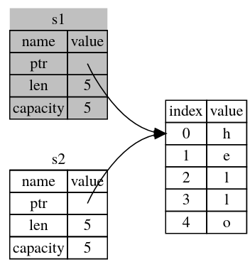
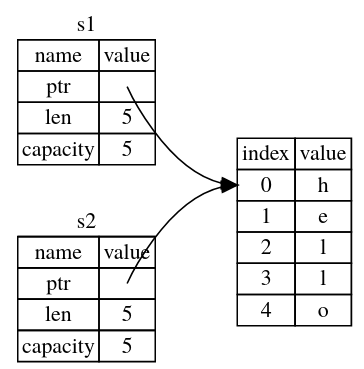
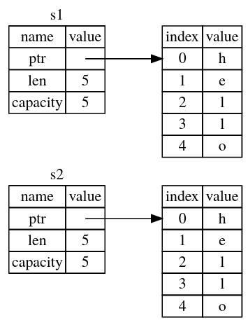

# Ownership

L'Ownership permette a rust la sicurezza della memoria e la gestione della memoria (senza garbage collector).

## Regole dell'Ownership 

- ogni valore in rust ha una variabile chiamate il suo `owner`
- ci può essere solo un `owner` alla volta
- Quando l'`owner` va fuori dallo scope, il valore viene lasciato

## Unknow size data

I dati che abbiamo visto prima hanno tutti una size prefissata e quindi possono essere storati nello stack, i dati la cui dimensione può cambiare durante il runtime invece andranno nella heap e solo l'indirizzo (che è fixed size) verrà storato nella stack.

Utilizzeremo **String** come esempio che è un tipo dinamico. La variabile stringa verrà rilasciata dalla memoria automaticamente quando andrà al di fuori dello scope (in particolare chiama la funzione `drop`).

<details>
<summary>
es
</summary>

```rust
fn main() {
    {
        let s = String::from("hello"); // s is valid from this point forward

        // do stuff with s
    }                                  // this scope is now over, and s is no
                                       // longer valid
}
```
</details>

```rust
fn main() {
    let s1 = String::from("hello");
    let s2 = s1;
}
```

In Rust non avviene ne una deep copy che una shallow copy, ma avviene un "move" del dato. ( in questo caso s1 si è mosso in s2)



Grazie a questo meccanismo non ci dobbiamo preuccupare che più variabili che puntano allo stesso oggetto vadano out-of-scope (quindi droppate) in momenti differenti (il che porterebbe ad un double free error)


<details>
<summary>
shallow copy
</summary>



</details>

<details>
<summary>
deep copy
</summary>



</details>

### Deep copy

La deep copy si può fare attraverso il metodo `clone` (copia anche il contenuto nell'heap)

### Copy Traid

Come abbiamo visto gli integer e altri tipi come i bool, float e i char, vengono direttamente copiati (senza il move).  

Questo avviene perchè questi tipi di dati implementano il trait `Copy`.


### Ownership e Funzioni

Il passaggio di parametri viene gestito come l'assegnamento.

```rust
fn main() {
    let s = String::from("hello");  // s comes into scope

    takes_ownership(s);             // s's value moves into the function...
                                    // ... and so is no longer valid here

    let x = 5;                      // x comes into scope

    makes_copy(x);                  // x would move into the function,
                                    // but i32 is Copy, so it's okay to still
                                    // use x afterward

} // Here, x goes out of scope, then s. But because s's value was moved, nothing
  // special happens.

fn takes_ownership(some_string: String) { // some_string comes into scope
    println!("{}", some_string);
} // Here, some_string goes out of scope and `drop` is called. The backing
  // memory is freed.

fn makes_copy(some_integer: i32) { // some_integer comes into scope
    println!("{}", some_integer);
} // Here, some_integer goes out of scope. Nothing special happens.
```

Quanto di **ritorna** un valore anche in questo caso viene trasferita la ownership.

```rust

fn main() {
    let s1 = gives_ownership();         // gives_ownership moves its return
                                        // value into s1

    let s2 = String::from("hello");     // s2 comes into scope

    let s3 = takes_and_gives_back(s2);  // s2 is moved into
                                        // takes_and_gives_back, which also
                                        // moves its return value into s3
} // Here, s3 goes out of scope and is dropped. s2 was moved, so nothing
  // happens. s1 goes out of scope and is dropped.

fn gives_ownership() -> String {             // gives_ownership will move its
                                             // return value into the function
                                             // that calls it

    let some_string = String::from("yours"); // some_string comes into scope

    some_string                              // some_string is returned and
                                             // moves out to the calling
                                             // function
}

// This function takes a String and returns one
fn takes_and_gives_back(a_string: String) -> String { // a_string comes into
                                                      // scope

    a_string  // a_string is returned and moves out to the calling function
}
```

## References and Borrowing

Il references è un pointer che garantisce che punti ad un dato valido e di un tipo particolare.

```rust
fn main() {
    let s1 = String::from("hello");
    
    let len = calculate_length(&s1);

    println!("The length of '{}' is {}.", s1, len);
}

fn calculate_length(s: &String) -> usize {
    s.len()
}
```

Per potere modificare il valore di un reference va reso mutabile sempre con la keyword `mut`, i **reference mutabili hanno una restrizione c'è ne può essere solo una alla volta**. Inoltre non possiamo avere **sia un immutable reference che un mutable reference**.
```rust
fn main() {
    let mut s = String::from("hello");

    change(&mut s);
}

fn change(some_string: &mut String) {
    some_string.push_str(", world");
}
```


## The Slice Type

Servono per creare un reference ad una parte della struttura.

### String Slice

I string slice sono dei `&str`.

```rust
fn main() {
let s = String::from("hello");

//uguali
let slice = &s[0..2];
let slice = &s[..2];

let len = s.len();
//uguali
let slice = &s[0..len];
let slice = &s[..];

}

```

### Array Slice

Anche gli array supportano i slice, per esempio gli `[i32]`.

```rust

#![allow(unused)]
fn main() {
let a = [1, 2, 3, 4, 5];

let slice = &a[1..3];

assert_eq!(slice, &[2, 3]);
}

```