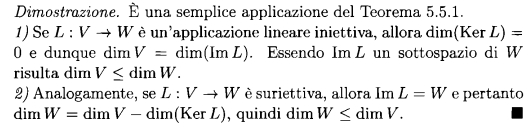

# Applicazini lineari e nuclei

## Funzioni

**def**: $f:A \to B$ una legge che per ogni elemento di A associa un solo elemento di B è un sottoinsieme $\Gamma$ di $A\times B$ tale che $\forall a \in A$ , $\exists ! b$ tale che $(a,b) \in \Gamma$, f è su $x \forall b \in B \exists a \in A$ tale che $f(a)=b$

### Immagine

$Im\space f=\{f(a)|a\in A\}=\{b\in B | \exists a \in A, b=f(a)\}$

### Iniettiva
f è iniettiva se $a_1 \neq a_2 \implies f(a_1)\neq f(a_2)=$, oppure  $f(a_1)= f(a_2) \implies a_1 = a_2$

### Surrettiva

una funzione è surrettiva quando $f:A \to B$, $\forall y \in B, \exists f(y) \in A$

### Biettiva

Una funzione è biettiva quando è sia surrettiva che iniettiva

### Composta

Se  $f: A \to B$, $g:B \to C$ allora $g \cdot f: A \to C$ 

## Applicazioni lineari 

**Def**(di applicazione lineare):V,W spaziz vettoriali, $F: V \to W$ si dice applicazione lineare di  se :
- $F(v+u)=F(u)+F(u), \forall v,u \in V$ 
- $\lambda F(v)=F(\lambda u)\forall v \in V, \lambda \in \mathbb{R}$

Conseguenza $F(\mu u+ \lambda v)=\mu F(u)+ \lambda F(v)$

**prep**: Siano $V,W$ spazi vettoriali, $F: V \to W$ è un applicazione lineare allora $F(\underline{0}_v)=\underline{0}_w$

dimostrazione

$F(0_v)=F(0 \times 0_v)=0 F(0_v)=0_w$

## Esistenza di una applicazione lineare tra due spazi vettoriali

**Teorema 5.1.7** Siano V e W due spazi vettoriali. Se $v_1,\dots,v_n$ è una base di V e consideriamo n vettori $w_1,\dots,w_n \in W$ non necessariamente distinti, allora **esiste ed è unica un' applicazione lineare** $L:V\to W$ tale che $L(v_1)=w_1,\dots,L(v_n)=w_n$

### Rappresentazione delle applicazioni lineari
**Teorema**:Data un applicazione lineare $F: \mathbb{R}^n \to \mathbb{R}^m$ fissiamo in $\mathbb{R}^n$ e $\mathbb{R}^m$  le rispettive basi canoniche. Allora possiamo equivalentemente rappresentare $F$ in uno dei seguenti metodi:
1. $F(e_n)=a_{1n}e_1+...\ +a_{mn}e_m$

2. $F(x_1...\ x_n) = \begin{bmatrix} a_{11}x_1+a_{12}x_2+...+a_{1n}x_n  \\ a_{21}x_1+a_{21}x_2+...+a_{2n}x_n  \\ \quad \quad \quad \quad \quad \quad \vdots \\ a_{m1}x_1+a_{m1}x_2+...+a_{mn}x_n \end{bmatrix}$
3. $F(x)=Ax, \quad \text{con} \quad A = \begin{bmatrix} a_{11} & a_{12} \quad & a_{1n} \\ a_{21} & a_{22} \quad & a_{2n} \\ \quad \quad \vdots \\ a_{m1} & a_{m2} \quad & a_{mn} \end{bmatrix} x= \begin{bmatrix} x_1 \\ x_2 \\ \vdots \\ x_n \end{bmatrix}$ 

esempio

Primo modo:   
$(5e_1+3e_2, ,-e_2, e_1-e_2)$

Secondo modo   

$F(e_1)=5e_1+3e_2$
$F(e_2)=-e_2$
$F(e_3)=e_1-e_2$

Terzo modo   

$A= \begin{pmatrix} 5 & 0 & 1 \\ 3 & -1 & -1 \end{pmatrix}$

## Immagine e nucleo

**Def**:(immagine e nucleo) Sia F $V \to W$ applicazione lineare :
- $Im \space F= \{F(v)| v\in V\} \subseteq W$
- $\ker F= \{v\in V|F(v)=\underline{0}\} \subseteq V$

**Prop**: Sia $L:V \to W$ un applicazione lineare:
- il nucleo di $\ker L$ sottospazio di V
- l'immagine $Im \space L$ è sottospazio di $W$

**prop**: Sia $L:V\to W$ un' applizazione lineare allora il sottospazio $Im \space L$  si può ottenere dal sottospazio generato da una base di V in L, $Im \space L=<L(v_1,\dots,v_n)>$ dove $\{v_1,\dots,v_n\}$ è una base di V

**Prop** Sia $F V \to W$ applicazione lineare:
1. F è surrettiva $\iff Im \space F =W$
2. F è iniettiva $\iff \ker  F =\{\underline{0}\}$

> Nota $\{\underline{0}\}$ ha dim 0, una sua base è $\emptyset$
> Un sottospazio di dim 1 è del tipo $\{\lambda u |\lambda \in \mathbb{R}\}$ con $u \neq \underline{0}=<u>$ 

dim

Supponiamo che F è iniettiva mostriamo che $\ker F =\{\underline{0}\}$ ricordiamo che F è iniettiva se $F(u)=F(v)\implies u=v$

## Calcolo del nucleo 

$F:\mathbb{R}^n  \to \mathbb{R}^m$

$\ker F=\{x\in \mathbb{R}^n|F(x)=\underline{0}\}$

Sia A matrice associata ad F

cioè $F=L_a$ cioè $F(x)=Ax$, $\ker F=\{x\in \mathbb{R}^n | A x= \underline{0}\}$

Quindi $\ker F$ è l'insieme delle soluzioni del sistema lineare omogeneo associato ad A

esmpio

Sia $F :\mathbb{R}^3 \to \mathbb{R}^3$ definita da:
- $F(e_1)=e_1-e_2+2e_3=(1,-1,2)$
- $F(e_2)=e_1+e_2-e_3=(1,1,-1)$
- $F(e_3)=2e_2+e_3=(2,0,1)$

$A=\begin{pmatrix}F(e_1) & F(e_2) &F(e_3) \\\ 1 & 1 & 2 \\ 1 & 1 &0 \\ 2 & -1 & 1\end{pmatrix}$

$\ker F={x \in \mathbb{R}^3| F(x)=\underline{0}}$= ${x \in \mathbb{R}^3| A x= \underline{0}}$

**Prep** $F:V\to W$ applicazione lineare. Sia $\beta = \{v_1,\dots,v_n\}$ di base V allora $Im \space F =< F(v_1),\dots,F(v_n)>$

## Teorema della dimensione

**Teorema**:Sia $F:V \to W$ applicazione lineare, allora $\dim V=\dim \ker F+ \dim Im \space F$

**prop 5.5.2**: V,W spazi vettoriali:
1. se la $\dim V > \dim W$ non esistono applicazioni lineari iniettive $F: V\to W$
2. se $\dim V < \dim W$ non esistono applicazioni surrettive lineari su $F: V \to W$

dim

## Isomorfismi

**Def:**(isomorfismo) un applicazione lineare si dice isomorfrismo se è invertivbile (o equivalentemente se è iniettiva e surrettiva)

**Def**:(spazi isomorfi) Due spazi vettoriali V e W sono isomorfi $\iff$ hanno la stessa dimensione ( si può dimostrare anche facendo vedere l'esistenza di un isomorfismo $L$ che va da $V$ a $W$)

dim

primo implica da fare per casa  (si usa il teorema della dimensione)

altra freccia: Sia $\dim V = \dim W = n$ vogliamo costruire un isomorfismo $F: V \to W$

Sia $\beta= \{v_1,\dots,v_n\}$ base di V, $\beta=\{w_1,\dots,w_n\}$ base di W

$F: V \to W$ tale che $F(v_i)=w_i \space  \forall 1=\{1,\dots,n\}$

$\Im F= <F(v_1),\dots,F(v_n)=<w_1,\dots,w_n>=W \implies F$ è surrettiva

Usando il teorema delal dimensione $\dim V =\dim \ker F+ \dim Im \space F$

$\implies \dim \ker F=0$

