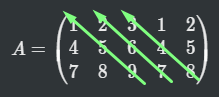
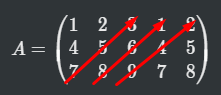

# Determinante

## identità

la matrice identità o matrice identica di ordine $n$, è la matrice $n\times n$ avente tutti gli elementi della diagonale principale uguali al numero 1, mentre i restanti elementi sono uguali a 0. solitamente viene indicata con $I_n$, o con $I$
  se non ci sono ambiguità

matrice di idoneità :$I=\begin{pmatrix}1&0&0\\0&1&0\\0&0&1\end{pmatrix}$ 

## Determinante

**Def**:il determinante è una funzione che ad ogni matrice quadrata A di ordine $n$ associa un numero reale, indicato con $\det(A)$, in modo che valgano

1. se la riga $j$-esima di $A$
 è somma di due elementi $ v$ e $ u$ di $\mathbb{R}^n$, allora il determinante di $A$ è la somma dei determinanti delle due matrici ottenute sostituendo alla riga $j$-esima di $A$ rispettivamente $ u$ e $ v$
2. se la riga $j$-esima di $A$ è il prodotto $\lambda u$, ove $ u$ è un'elemento di $\mathbb{R}^n$ e $\lambda$ è uno scalare, allora il determinante di $A$ è il prodotto di $\lambda$ e del determinante della matrice ottenuta sostituendo la riga $j$-esima di $A$ con $ u$
3. se due righe di $A$ sono uguali, allora il determinante di $A$ è nullo
4. se $I$ è la matrice identità, allora $\det(I)=1$

**Prep**(proprietà del determinatne)siano $A$ e $B$ due matrici quadrate di ordine $n$

1. se $B$ è ottenuta da A scambiando due righe, allora $\det(A)=-\det(B)$
2. se $B$ è ottenuta da $A$  sommando ad una riga di $A$ una qualunque combinazione lineare delle altre righe, allora $\det (B)=\det (A)$
3. se $A$ è una matrice triangolare superiore o inferiore, ovvero i coefficienti al di sotto o al di sopra della diagonale principale sono tutti uguali a 0, allora il determinante di $A$ è il prodotto degli elementi che si trovano sulla sua diagonale principale

## Calcolo del determinante

### 2x2 o 3x3

**2x2** (la dimostrazine è sul libro e fa semplicemente i casi): 
$\det \begin{pmatrix}a_{11}&a_{12}\\a_{21}&a_{22}\end{pmatrix}=$ $a_{11}a_{22}-a_{21}a_{12}$

**3x3**:

$A= \begin{pmatrix} a_{11}&a_{12}&a_{13}\\ a_{21}&a_{22}&a_{23}\\ a_{31}&a_{32}&a_{33} \end{pmatrix}$

La riscrivo come segue (ricopio le prime 2 colonne a fianco)

$A= \begin{pmatrix} a_{11}&a_{12}&a_{13}&a_{11}&a_{12}\\ a_{21}&a_{22}&a_{23}&a_{21}&a_{22}\\ a_{31}&a_{32}&a_{33}&a_{31}&a_{32} \end{pmatrix}$

$det(A)=$ (somma delle 3 linee verdi) - (somma delle 3 linee rosse)

### Qualsiasi Dimensione
sia $A$ una matrice quadrata

1. se $A$ ha ordine 1, cioè $A=(a_{11})$ ha una riga e una colonna. poniamo $\det(A)=a_{11}$
2. supponiamo ora di saper calcolare il determinante delle matrici di ordine $n-1$

sia

$$
\Gamma_{ij}=(-1)^{i+j}\det(A_{ij})
$$

allora

$$
\det(A)=a_{11}\Gamma_{11}+a_{12}\Gamma_{12}+...+a_{1n}\Gamma_{1n}=\\
\sum^n_{k=1}a_{1k}\Gamma_{1k}
$$

## Teorema di Binet

Sia $A,B \in M_{n,n}(\mathbb{R})$ allora $\det(AB)=det(A)\times \det(B)$

## Matrice Invertibile

**Def**: Sia $a \in m_{n,n}(\mathbb{r})$ si dice invertibile se esisete una matrice $B\in M_{n,n}(\mathbb{R})$ tale che $AB=I=BA$ (i è la matrice d'identità)

**prop**: $a \in m_{n,n}(\mathbb{r})$  è invertibile $\iff \det(A)\neq 0$

dimostrazione

Ip Sia A invertibile e sia B l'inversa, quindi $AB=I$ per il teorema di binet, il $\det(AB)=\det(A)\times \det(B)$ essendo che il determinante I è uguale a uno il determinante deve essere diverso da zero

($\det(A^{-1})=\frac{1}{\det(B)}$)

Per determinare se A è diverso da zero si può costruire l'inversa di A nel modo seguente.

$$
(A^{-1})_{ij}=\frac{1}{\det A }(-1)^{i+j} \det(A_{ij})
$$

## Gauss per il calcolo dell'inversa

Calcoliamo l'inversa con gauss. Si scrive la matrice $n\times 2n,\space A |I$ con l'algoritmo di gauss si arriva ad avere $I|B$, B  è l'inversa di A. Una volta che A ridotta a scala per ottenere I, prima si mettono tutti i pivot=1, si applica l'algoritmo di gauss "a ritroso"

## Teoremone

**Teorema**sia $F:\mathbb{R}^n\to\mathbb{R}^n$ applicazione lineare e sia $A$ la matrice ad essa associata

$F=L_A, F(\underline x)=A\underline x$ (non necessario)

le seguenti affermazioni sono equivalenti

1. $F$ è un isomorfismo (iniettiva e suriettiva)
2. $F$ è iniettiva
3. $F$ è suriettiva
4. $\dim(Im\ F)=n$
5. $rg(A)=n$
6. le colonne di $A$ sono linearmente indipendenti
7. le righe di $A$ sono linearmente indipendenti
8. il sistema $A x=0$ ha un'unica soluzione
9. $\forall  b \in \mathbb{R}^n$ il sistema $A x= b$ ha un'unica soluzione
10. $A$ è invertibile
11. $\det(A)\ne0$

    

        dimostrazione
    

    
 
Per (.1) 1,2,3 sono equivalenti.

3 $\Rightarrow$ 4   perché $F$ suriettiva $\Rightarrow$ $ImF=\mathbb{R}^n$ ha dimensione $n$

4 $\Rightarrow$ 5   perché $rg(A)=dim(Im(F))$ per (.2)

5 $\Rightarrow$ 6               per def. di rango di una matrice

6 $\Rightarrow$ 7               perché $rr(A)=rg(A)$

7 $\Rightarrow$ 8   perché se righe di $A$ lin. indip. quando si applica Gauss per risolvere $Ax=0$ si trova una matrice a scala con $n$ pivot, quindi soluzione unica

8 $\Rightarrow$ 9               se il sistema $Ax=0$ ha soluzione unica, riducendo a scala $A$ si ottiene $A'$ con esattamente $n$  pivot, quindi riducendo a scala $(A|b)$ si ottiene $(A'|b')$ che ha $n$ pivot (quelli di $A'$), quindi $Ax=b$ ha souzione unica

9 $\Rightarrow$ 2               per (.3) basta mostrare $\ker F= 0$, ma $\ker F$  è formato dalle soluzioni del sistema lineare omogeneo $Ax=0$, e grazie al 9, prendendo $x=0$ esso ha solo una soluzione, che deve per forza essere nulla, quindi $F$ iniettiva

Quindi da 2 a 9 è dimostrato che sono equivalenti.

1 $\Rightarrow$ 10           sia $G$ l'inversa di $F$, $F \circ G = G \circ F = id_{\mathbb{R}^n}$.
Sia $B$ la matrice associata a $G$ rispetto alla base canonica, allora $AB=BA=I$, quindi $B$ inversa di $A$.

10 $\Rightarrow$ 1   perché se $B$ inversa di $A$ e $L_B: \mathbb{R}^n \longrightarrow \mathbb{R}^n$ è l'applicazione lineare associata, allora $L_B$ è l'inversa di $F$

10 è equivalente a 11 per (.4)

----- 

(.1) se $dim V>dimW$, non esistono applicazioni lineari iniettive da $V$ in $W$
    se $dimV<dimW$, non esistono applicazioni suriettive da $V$ in $W$

(.2) se si legge $A$ come la matrice associata all'applicazione lineare $L_A:\mathbb{R}^n \longrightarrow \mathbb{R}^m$ rispetto alle basi canoniche, allora il rango colonne di $A$ è la dimensione dell'immagine di $L_A$

(.3) sia $L:V \longrightarrow W$ un'applicazione lineare:

1. $L$ iniettiva $\Leftrightarrow$ $\ker L= 0_V$
2. $L$ suriettiva $\Leftrightarrow ImL=W$, cioé l'immagine coincide col codominio

(.4) la matrice $A$ è invertibile $\Leftrightarrow$ $\det A \neq 0$

> Nota:{Soluzione di $Ax=b$}=$F^{-1}(b)$=$\{v+z|z\in \ker F\}$

