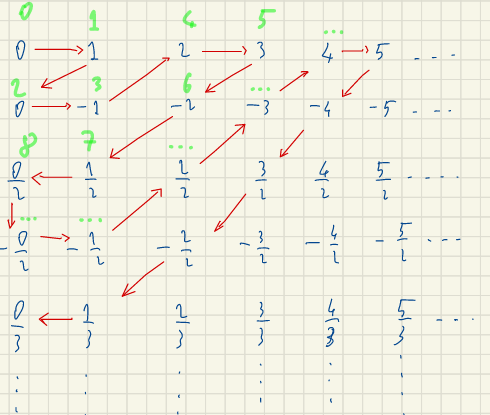
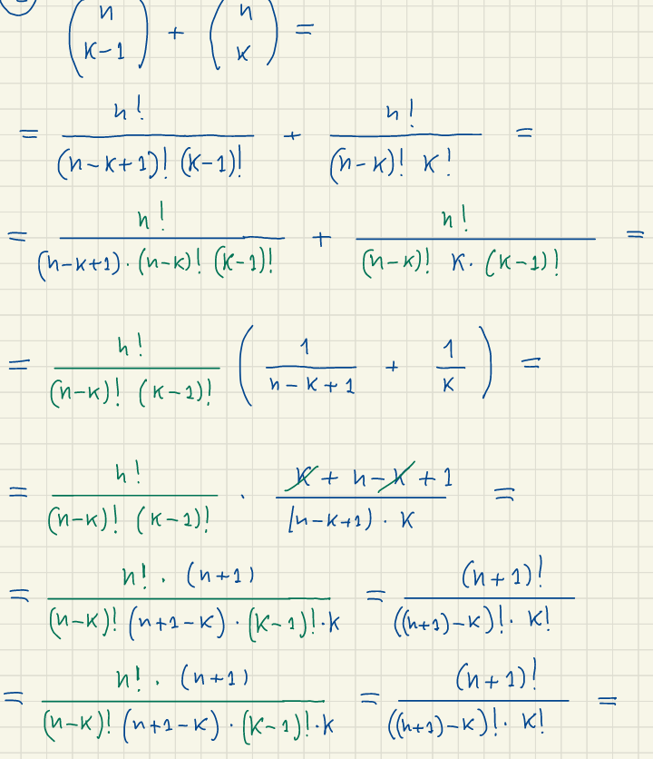
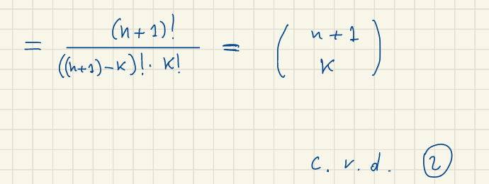
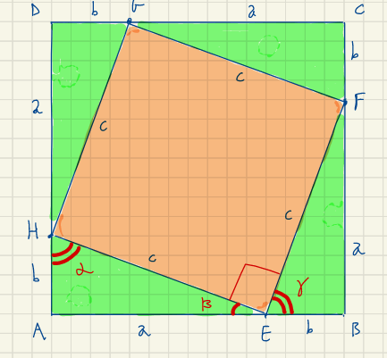
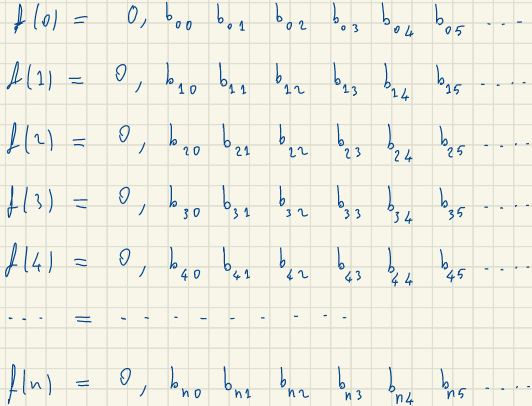
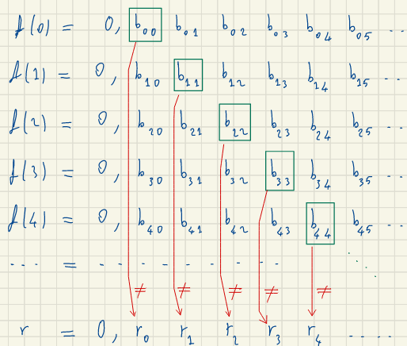

- [1. Introduzione](#1-introduzione)
  - [1.1. Requisiti](#11-requisiti)
  - [1.2. Modulo 1](#12-modulo-1)
  - [1.3. Modulo 2](#13-modulo-2)
  - [1.4. Esame](#14-esame)
    - [1.4.1. Sessioni](#141-sessioni)
- [2. Insiemi numerici, e le loro proprietà](#2-insiemi-numerici-e-le-loro-proprietà)
  - [2.1. Notazioni](#21-notazioni)
- [3. Insiemistica](#3-insiemistica)
- [4. Logica](#4-logica)
- [5. Funzioni](#5-funzioni)
    - [5.0.1. Iniettività](#501-iniettività)
    - [5.0.2. Surettività](#502-surettività)
    - [5.0.3. Biunivoca](#503-biunivoca)
    - [Inisme immagine](#inisme-immagine)
  - [5.1. Cardinalità](#51-cardinalità)
  - [5.2. Numberailità](#52-numberailità)
- [6. Calcolo Combinatorio](#6-calcolo-combinatorio)
  - [6.1. Fattorial (permutazioni)](#61-fattorial-permutazioni)
  - [6.2. Coefficente Binomiale (combinazioni)](#62-coefficente-binomiale-combinazioni)
  - [6.3. Il binomio di Newton](#63-il-binomio-di-newton)
- [7. Esempi di Dimostrazioni](#7-esempi-di-dimostrazioni)
  - [Teorema di pitagora](#teorema-di-pitagora)
  - [teorema di Euclide (Numeri primi)](#teorema-di-euclide-numeri-primi)
- [8. L'insieme dei numeri reali](#8-linsieme-dei-numeri-reali)
  - [8.1. Intervalli di $\mathbb{R}$](#81-intervalli-di-mathbbr)
    - [Intervalli](#intervalli)
    - [Ineismi Limitati](#ineismi-limitati)
    - [Minimo Massimo di un insieme](#minimo-massimo-di-un-insieme)
  - [8.2. l'insime $\mathbb{R}$](#82-linsime-mathbbr)
  - [Esistenza e uniticità della radice](#esistenza-e-uniticità-della-radice)
    - [Teorema di esistenza di $\sqrt{}$](#teorema-di-esistenza-di-sqrt)
- [9. Varole Assoluto](#9-varole-assoluto)
  - [Prioprità](#prioprità)
- [Successioni Numeriche](#successioni-numeriche)
  - [Limiti delle successioni](#limiti-delle-successioni)
  - [Limiti](#limiti)

# 1. Introduzione

Insegnante: Marco Maghetti

`marco.maghetti@unibi.it`

[Materiale](https://virtuale.unibo.it/course/view.php?id=28828)

## 1.1. Requisiti

- algebra elementare
- equazioni algebriche
- disequazioni di primo e secondo grado
- disequazioni frazionarie
- equazioni e disequazioni goniometriche elementari
- equazioni e disequazioni logaritmiche e esponenziali
- elementi di geometria analitica

## 1.2. Modulo 1

- Insiemi numerici, e le loro proprietà
- Funzioni elementari (esponenziali,logaritmi,trigonometria)
- successioni numeriche
- Limiti
- Funzioni per la cardinalità
- funzioni derivabili
- grafico di una funzione
- formula ti Taylor per le funzioni regolare

## 1.3. Modulo 2

## 1.4. Esame

1. prova scritta (che serve per entrare all'orale) esercizi + alcune domande di teoria
2. prova orale (deve essere passata nella stessa sessione ma anche in appelli differenti)

### 1.4.1. Sessioni

ci sono quattro sessioni ed ogni sessione ha un gruppo d'appelli (esistono sessioni estive, autunnali e invernali).

il primo analisi ci sarà in giugno 2022.

# 2. Insiemi numerici, e le loro proprietà

**numeri naturiali** : $N =\{1,2,3,4...\}$   

**numeri interi** : i numeri interi hanno la proprietà di avere l'opposto,  $Z =\{..-2,-1,0,1,2,...\}$ 

**numeri razionali** : ogni unmero ha l'opposto e l'inverso, $Q =\{\frac{p}{q} | p \in N, q \in Z, p \neq 0 \}$  
$Q = \{ \frac{n}{m} | n \in N, m \in Z \backslash \{0\}, MCD(n,|m|)=1\}$

**numeri reali** :  $R$

## 2.1. Notazioni

|symbolo       | spiegazione                                                   |
|--------      |-------------                                                  |
|$\in$         |Indica che un elemento appartiene ad un insieme                |
|$\notin$      |non appartiene                                                 |
|$\forall$     |per tutti gli elementi di un insieme                           |
|$:$ oppure \| |tale che                                                       |
|$\exists$     |Esiste almeno un elemento                                      |
|$\nexists$    |Non esiste neanche un elemento                                 |
|$\exists!$    |Esiste un solo elemento                                        |
|$\subseteq$   |$A \subseteq B$ indica che A è un sottoinsieme o uguale a B    |
|$\nsubseteq$  |$A \nsubseteq B$ c'è almeno un elemento in A che non è in B    |
|$\cup$        |unione tra due iniemi                                          |
|$\cap$        |crea un insieme con gli elementi comuni dei due insiemi        |
|$\emptyset$   |insieme vuoto (è un subset di tutti gli insiemi)               |
|$\backslash$  |differenza tra insiemi (non è commutativa}                     |
|$\upsilon$    |inisme universo è un insieme definito per fare il complementare|
|$C(A)$        |diffrerenza tra un insieme universo e l'insieme A              |
|$\wedge$      |E logioco (and)                                                |
|$\vee$        |O logioco (or)                                                 |
|$\Rightarrow$ |è il simbolo di implicazione logica                            |
|$\bar{p}$     |è la negazione della preposizione p                            |
|$\displaystyle \sum_{i=0}^n a_i= a_0 + a_1 + a_2+ ... +a_n$| sommatoria |

TODO:finire di aggiungere le notazioni viste

# 3. Insiemistica 

> un insieme è definito dai suoi elementi, e non dal loro ordine 

    

        operazioni
    

TODO: da finire di aggiungere le operazioni e scrivere la loro definizione

**Unione Insiemi**: crea un insieme contenente tutti gli elementi comuni a A e B
A,B sono insiemi  
$A \cap B = \{x | x \in A \wedge x \in B \}$  

**Moltiplicazione Insiemi**(prodotto cartesiano): associa ogni elemento dell'insieme A tutti gli elementi dell'insieme B creando delle coppie ordinate
A,B sono insiemi  
$A$ x $B$ = $\{ (a,b) | a \in A \vee b \in B\}$  
$A$ x $B \neq B$ x $A$

# 4. Logica

> p = proposizione (è un affermazione che può essere o vera o falsa)

$\bar{p}$ = "non p", è la negazione di p

attezione :
- la negazione di tutti è esiste almeno un elemento $\bar{\forall}$ = $\exists$  
- la negazioni di esiste almeno un elementeo è tutti  $\bar{\exists}$ = $\forall$

    

        esempi
    

es.
p = ogni elemento di A è un numero pari  
$\forall a \in A : \text{a è pari}$   
$\bar{p} = \exists a \in A : \text{a non è pari}$ 

$p \Rightarrow q$ = "p implica q" (p si chiama ipotesi e q si chiama tesi)

    

        tabella di verità e equivalenza
    

| p | q |$p \Rightarrow q$| 
|---|---|---------------------|
| V | V |           V         |
| V | F |           F         |
| F | V |           V         |
| F | F |           V         

$p \Leftrightarrow q$ = "p implica q" 

significa che $(p \Rightarrow q) \wedge( q \Rightarrow q)$

"è sufficiente p affinché q"

    

        tabella di verità
    

| p | q |$p \Leftrightarrow q$| 
|---|---|---------------------|
| V | V |           V         |
| V | F |           F         |
| F | V |           F         |
| F | F |           V         |

# 5. Funzioni

$f: A \rightarrow B$ $x \overrightarrow{f} f(x)$:
- A è il dominio di $f$ 
- B è il codominio di $f$
- $f$ è la legge di associazione

> f è la legge d'associazione che associa un elemento nell'insieme A in un insieme B (la funzione è definita dal: dominio,codominio e legge di associazione ($A,B,f$))  
$\forall x \in A, \exists! b \in B : f(x) = b$ 

due funzioni sono uguali se e solo se il dominio il codominio e la legge di associazione sono uguali:

$f: A \rightarrow B \\ f': A'\rightarrow B' \\ \begin{cases} A=A' \\ B=B' \\ f=f'\end{cases}$

### 5.0.1. Iniettività

> prioprietà iniettiva (1-1): tutti gli elementi del codominio sono associati a un elemento del codominio diverso
 $f: A \rightarrow B$ se $\forall a \in A,\forall a' \in A : a\neq a' \rightarrow f(a) \neq f(a')$

> l'inniettività dipenda dal dominio

    

    esempio
    

$f(n)=n^2$ non è (1-1) perchè $f(-1)=1=f(1)$  
ma la si può far diventare mettendo come dominio R+

$f(n)=n^3$ è (1-1)

### 5.0.2. Surettività

> surrettiva (su) ogni elemento del codominio deve avere un elemento del dominio per cui f(a)=b
$\forall b \in B, \exists a \in A : f(a)=b$

> la surrettività dipenda dal codominio

    

    esempio
    

$f: A \rightarrow B$  
$f(n)=n^2$ non è (su) perché $\forall b \in B, \nexists a \in A : f(a)=b$  
ma la si può far diventare mettendo come codominio R+

$f(n)=n^3$ è (su)

### 5.0.3. Biunivoca

> Una funzione sia surrettiva che invettiva è detta biunivoca e quindi è invertibile

$f: A \rightarrow B$ è invertibile
$f^{-1}: A \rightarrow B$ e vuol dire che:
- $\forall a \in A: f^{-1}(f(a))=a$  
- $\forall b \in B: f(f^{-1}(b))=b$  

$f$ è ivertibile $\leftrightarrow f$ è biunivoca 

### Inisme immagine
> l'immagine di una funzione sono tutti gli elementi di b che sono associati con a

$\text{Img} f = \{ b \in B | \exists a \in A : f(a)=b \}$  
$\text{Img} f \subseteq B$

## 5.1. Cardinalità

perchè vengono estesi i numeri razionali a quelli reali

> la cardinalità di un insieme è il numero di elementi di un insieme

due insiemi sono **equipotenti** solo se i due insiemi **hanno la stessa cardinaltà**.  
Si può dimostrare  due insiemi sono equipotenti se c'è una **corrispondenza biunivoca** (molto utile con gli insiemi infiniti).

$N$ e $Z$ sono inifiniti
$N \subsetneqq Z$

$N$ e $Z$ sono equipotenti

    

    dimostrazione che  N e Z sono equipotenti
    

per dimostrare che $\mathbb{N}$ e $\mathbb{Z}$ sono equipotenti creaiamo una funzione biunivoca tra i due 

$f(n)= \begin{cases} n/2 & \text{se n è pari} \\ -\frac{n+1}{2} & \text{se n è pari} \end{cases}$

## 5.2. Numberailità 

> un insieme è numberabile se esiste una funzione $f : N \rightarrow A$ è biunivoca 

> lemma: è un piccolo teorema

> (Lemma) A è numerabile se è solo se 
$f_1 : A \rightarrow \mathbb{N}$ è surrettiva  
$f_2 : \mathbb{N} \rightarrow A$ è surrettiva

si può provare che l'insieme dei numeri razionali è numerabile

    

    prova numerabilità di Q    
    

come prima cosa si crea una tabella che contiene tutti i numeri razionali, a quel punto si collega ogni numero naturale a un numero razionale

# 6. Calcolo Combinatorio

> permutazioni: contano l'ordine degli elementi

> combinazioni: contano il numero di set diversi

## 6.1. Fattorial (permutazioni)

$n!= 1*2*3*4*5*...*(n-1)*n, n\in \mathbb{N}$ , $0!=1$

il **fattoriale** si usa per **contare le permutazioni di una lista di elementi diversi**.

## 6.2. Coefficente Binomiale (combinazioni)

$n \in \mathbb{N}, m \in \mathbb{N}$

$\frac{n!}{k!(n - m)!} = \binom{n}{m} = {}^{n}C_{m} = C_{n}^m$

il **binomiale** si usa per contare **quanti sottoinsiemi partendo di m elementi posso formare partendo da un insieme di n**(non contano gli ordini,combinazioni).

**Proprietà**:

    
1.  $\binom{n}{k}=\binom{n}{n-k}$
2.  $\binom{n+1}{k}=\binom{n}{k-1}+\binom{n}{k}$

    

    Prova coefficiente binomiale
    

1. dimostrazione della prima prioperietà:  
se ci si pensa noi stiamo selezionando combinazioni k elementi partendo da un insieme di n, facendo così creaiamo un altro inieme di n-k elementi complementare per cui ha le stesse combinazioni
2. dimostrazione seconda proprietà:

## 6.3. Il binomio di Newton

Come si calcola il binomio $(a+b)^n=?$

TODO: spiegare con parole tue come si calcola il coefficente di ogni binomio

**Formula del binomio di newton**

$(a+b)^n=\displaystyle \sum^{n}_{k=0} \binom{n}{k} a^{n-k}*b^k$

# 7. Esempi di Dimostrazioni

## Teorema di pitagora

dipende dall'assioma che dice che gli angoli del triangolo rettangolo misurano 180°

$Area(ABCD)=(a+b)^2$  
$Area(EFGH)=c^2$  
$Area(ABCD)-Area(EFGH)=4*\frac{ab}{2}$  

$(a+b)^2-c^2=4\frac{ab}{2}$
$a^2+b^2+2ab-c^2=2ab$
$a^2+b^2-c^2=0$
$a^2+b^2=c^2$

## teorema di Euclide (Numeri primi)

Quanti sono i nueri primi?

Dimostrazione per assurdo, supponiamo che i numueri primi siano finiti, possiamo elencarli in ordine crescente:

$1<p_1<p_2<p_3<...<p_n$

Creiamo un numero $m\coloneqq p_1\times p_2 \times ... \times p_n +1$, essendo che m è più grande di tutti i numeri primi in particolare più grande di $p_n$ non dovrebbe essere un numero primo, quindi può essere diviso da un numero primo.

Se $m$ fosse divisibile per $p_1$ allora $\exist m_1 \in \mathbb{N}: m_1 \times p_1=m=p_1\times p_2 \times ... \times p_n +1$    
$m_1\times p_1 -( p_1\times p_2 \times ... \times p_n )=1$  
$ p_1 (m_1 - p_2 \times ... \times p_n )=1$  
$ p_1 (m_1 - p_1\times p_2 \times ... \times p_n )=1$  
quindi: $ p_1 =1$  

essendo che $m$ non è divisibile per nessuno primo, $m$ è primo.

# 8. L'insieme dei numeri reali

i numeri razionali sono quanti sono i punti della retta? quindi possiamo trovare una funzione biunivoca tra i $\mathbb{Q}$ e i punti sulla retta?.

Prendiamo il punto $\sqrt{2}$ che è sulla retta, è rappresentabile con i numeri razionali

**Dimostrazione per assurdo**: 

Assumiamo $\sqrt{2} \in \mathbb{Q}$ Quindi:  
$\exists m,n \in \mathbb{N} | \sqrt{2} = \frac{m}{n}$

Supponiamo che la frazione sia ridotta ai minimi termini: $MCD(m,n)=1$

$\sqrt{2} = \frac{m}{n}$  
$2 = \frac{m^2}{n^2}$   
$2n^2 = m^2$   

allora $m^2$ è pari quindi $\exist m_1 \in \mathbb{N}: m=2m_1$

$2n^2 = (2m_1)^2$   
$n^2 = 2(m_1)^2$   

$n^2$ è pari ma  $MCD(m,n)=1$ quindi è impossibile

TODO: aggiugere dimostrazione per un numero $\sqrt{n}$ \in $\mathbb{Q}$

## 8.1. Intervalli di $\mathbb{R}$

### Intervalli
$[a,b]=\{x \in \mathbb{R} | a \leq n\leq b\}$  
$]a,b[=\{x \in \mathbb{R} | a \le n\le b\}$  
$[a, \infty [=\{x \in \mathbb{R} | a \le n\}$  

### Ineismi Limitati
**Insieme Limitato superiormente**   
$M \in \mathbb{R}$ si dice maggiorante di A se:
$\forall a \in A$:  $M \leq a$

> se A ammette un maggiorante si dice superiormente limitata

**Insieme Limitato inferiormente**   
$\mathbb{m} \in \mathbb{R}$ si dice minorante di A se:
$\forall a \in A$: a \leq $\mathbb{m}  $

> se A ammette un minorante A si dice inferiormente limitato

**Insieme Limitato**  
> se A ammette sia un minorante che un maggiorante è limitato

### Minimo Massimo di un insieme
**minimo di un insieme**:  
$\forall a \in A : b \leq A$ (b è i minimo )

**massimo di un insieme**:  
$\forall a \in A : a \leq b$ (b è il massimo)

Per esmpio $]3,4]$ ha un massimo ma non un minimo

se un a il minimo è il più grande dei minoranti

se un a il massimo è il più grande dei maggioranti

se A è superiormente limitato ha il minimo dei maggioranti $\sup A$, se B non è superiormente limitato  $\sup B= +\infty$

se A è inferiormente limitato ha il massimo dei minorandi $\inf A$, se B non è inferiormente limitato  $\inf B= +\infty$

Q a differenza di R non ha sempre la proprietà di avere un massimando e un minorando es. $\{q \in \mathbb{Q}| q \le \sqrt{2}\}$

## 8.2. l'insime $\mathbb{R}$

N, Z e Q hanno la stessa cardinalità mentre R ha una cardinalità maggiore $|\mathbb{N}|<|\mathbb{R}|$.

**Dimostrazione per Assurdo**

Supponiamo che esista una funzione:$f:\mathbb{N} \Rightarrow [0,1[$ 
definiamo la funzione come:

allora possiamo crere un numero reale $a \in [0,1[$ tale che $f(n)\neq a \forall n \in \mathbb{N}$

costruiamo a usando un procedimento diagolnale

$r_j=\begin{cases}5 & \text{se } b_{jj}\neq 5 \\ 6 & \text{se } b_{jj}=5\end{cases}$

## Esistenza e uniticità della radice

$\forall a \in \mathbb{R_{+}}, \forall n \in \mathbb{N} /\ \{0\} : \exists! b \in \mathbb{R_{+}} : b^n=a$

**Abuso di notazione**:b si dice radice artimetica n-esima di a e si scrive $\sqrt{a}^{n}\coloneqq b$.

Oss: la radice **aritmetica è un numero $\ge 0$** quindi $\sqrt{4}=2$

TODO: ricopiare il lemma pag 5

**Lemma**:

$\forall n,y \in \mathbb{R}: x,y \ge 0$
si ha:
1. $x^2 \le y^2 \Leftrightarrow x \le  y$
2. $x^2 \ge y^2 \Leftrightarrow x \ge y$
3. $x^2 = y^2 \Leftrightarrow x = y$

TODO: mandcano le ultime

### Teorema di esistenza di $\sqrt{}$

cosiderando l'insieme $A = \{c \in \mathbb{R} | c \ge 0 , c^2 \le a\}$

# 9. Varole Assoluto

$a \in R$  
$|a| \coloneqq max\{a,-a\}$

## Prioprità

1. $|a| \ge 0$
2. $|-a|=|a|$ 
3. $-|a|\le a \le |a|$
4. $|a+b|\le |a|+|b|$
5. $||a|-|b||\le |a-b|$
6. $|a| \le b \Leftrightarrow -b \le a \le b$
7. $|a| \ge b \Leftrightarrow a \le -b \vee a \ge b$

# Successioni Numeriche 

successioni di numeri reali è una funzione, perchè essendo una successione devono essere numerati

allora creaiamo $f: \mathbb{N} \rightarrow R$   

$f(0)=a_0$ primo elemento  
$f(1)=a_1$ secondo elmento  
$f(2)=a_2$ terzo elemento  

$\mathbb{N} /\ \{0\} = \mathbb{N^*}$

Esempi:

$a_n = \frac{n}{n+1}, n \in \mathbb{N}$  
$a_n = \frac{(-1)^2}{n+1}, n \in \mathbb{N^*}$  

## Limiti delle successioni

Anche le successioni posono essere limitate superiormente o inferiormente o entrabmbi.

es:
TODO:aggiungere

$a_n =\frac{n}{n+1} \rightarrow 1$

## Limiti

$(a_n)_m , L \in \mathbb{R} \text{  si dice che } \lim_{n \rightarrow \inf} = L$ se $\forall e >0, $

TODO: da completare
