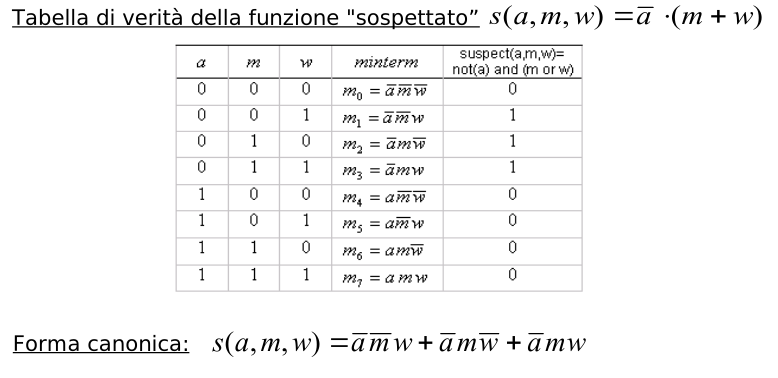

# Funzioni Esponenziali e Trigonometriche

## Funzione Esponenziale

$a \in \mathbb{R} , a<0 , a \neq 1$

$y=a^x$

**oss**: $a>0$

$a=-2$

$(a)^3=-8$
$(a)^{\frac{6}{2}}\sqrt{-2^6}=\sqrt{64}=8$

non coincidono 

**Notazione**

$\exp_a(x){:=} a^n$

se si sceglie come base di a della funzione esponenziale il numero $e$

$e^x$

l'esponenziale a base naturale (nome per indicare la $e$)

$\exp : \mathbb{R} \rightarrow \mathbb{R}^{*}$

TODO: aggiungere grafici

## Funzione Logaritmica

$a \in \mathbb{R} , a<0 , a \neq 1$  
$\forall y \in \mathbb{R}: y>0 \exist! x \in \mathbb{R}:$

$a^x=y$

$\log_a y {:=} x$ (si legge logaritmo di y in base a)

$\log : \mathbb{R}^{*}_{+} \rightarrow \mathbb{R}$

    

    esempi
    

$\log_2 16=4$  
$\log_2 1=0$

TODO: dimostrare che la funzine è inversa

## Funzioni gognometriche

**circonferenza gognometrica**: circonferenza di raggio uno con il centro sugli assi $x^2+y^2=1$ (lunghezza $2\pi$)

TODO: add immagini

### Radianti

$\alpha°$: angolo in gradi (non da informazioni sulla lunghezza dell'angolo)  
$\alpha_r$: angolo in gradi

$\alpha°:360=\alpha_r:2\pi \\ \alpha_r=\frac{\alpha° \times \pi}{360}$  

### Seno e Coseno

sia $P(x_p,y_p)$ un punto sulla circonferenza goniometrica

$\sin \alpha =y_p$  
$\cos \alpha =x_p$  

**Oss**: possiamo scrivere $\sin^2 \alpha +\cos^2\alpha=1$

$\sin \alpha =\sin \alpha \times 2\pi n$ dove $n \in \mathbb{N}$

si possono ricavare il $\sin$ dal $\cos$ e viceversa utilizzando la circonferenza goniometrica

$\sin \alpha=\mp \sqrt{1-\cos^2 \alpha}$

**Oss**:  
la funzione $\sin$ è dispari ($-\sin(\alpha)=\sin(-\alpha)$)

la funzione $\cos$ è pari ($\cos(\alpha)=\cos(-\alpha)$)

## Funzione Tangente

$\tan \alpha {:=} y_T$ (si legge tangente di  $\alpha$)

si come conseguenza della definizione si ha che :$\frac{\sin \alpha}{\cos \alpha}$

la tangente non è definita per:
- $\alpha = \frac{\pi}{2},\frac{3\pi}{2}..$
- $\alpha = -\frac{\pi}{2},-\frac{3\pi}{2}..$

## Angoli speciali

$\alpha= \frac{\pi}{4}$

TODO:aggiungere l'immagine e ricopiarli

$\alpha= \frac{\pi}{4}$

TODO: aggiungerli tutti

## Grafici 

## Formule di Addizione e Sottrazione

TODO: da aggiungere

$\cos(\alpha-\beta)=\cos \alpha \times \cos \beta +\sin \alpha \times \sin \beta$

$\cos(\alpha+\beta)=\cos \alpha \times \cos \beta -\sin \alpha \times \sin \beta$

$\sin(\alpha-\beta)=\sin \alpha \times \cos \beta -\cos \alpha \times \sin \beta$

$\sin(\alpha+\beta)=\sin \alpha \times \cos \beta -\cos \alpha \times \sin \beta$

