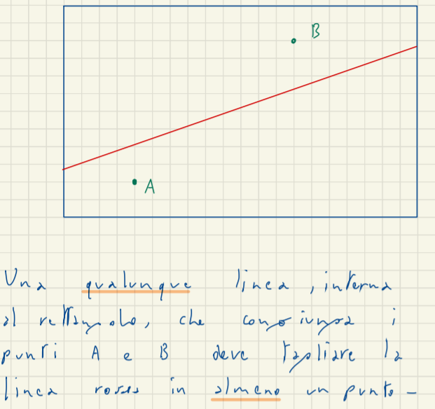
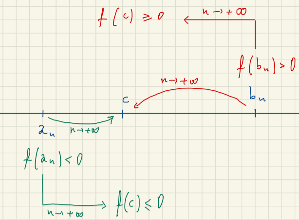
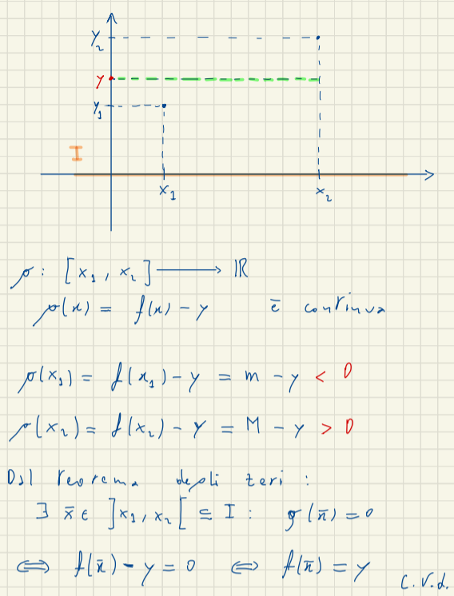

# Teorema degli Zeri

## Inutizione

Se abbiamo una funzione continua che in un certo punto è negativa e in un altro è positiva sappiamo che la funzione ha al minimo un punto in cui si annulla.

## Algoritmo 

$f: [a,b] \to \mathbb{R}$ continua  $f(a)\times f(b) <0 \implies \exists c \in ]a,b[: f(c)=0$

per trovare il punto in cui passa da zero utilizziamo questo algoritmo.
$f(a)<0$ e $f(b)>0$ costruiamo due successioni $(a_b)_n$, $(b_n)_n$

prendiamo il punto medio $\frac{(a+b)}{2}$ possiamo avere tre casi:  
1. $f(\frac{a_n+b_n}{2}) = 0$  fine 
2. $f(\frac{a_n+b_n}{2}) < 0$ $a_{n+1}=\frac{a_n+b_n}{2}, b_{n+1}=b_n$
3. $f(\frac{a_n+b_n}{2}) > 0$ $b_{n+1}=\frac{a_n+b_n}{2}, a_{n+1}=a_n$

Allora le $a_n$ e $b_n$ hanno delle proprietà:
1. $a_n$ è cerescente $a_n \le a_{n+1} \mbox{ }\forall n \in \mathbb{N}$ 
2. $b_n$ è cerescente $b_n \ge b_{n+1} \mbox{ }\forall n \in \mathbb{N}$ 
3. $f(a_n)<0,f(b_n)>0 \forall n \in \mathbb{N}$
4. $b_n - a_n = \frac{a_{n-1}-b_{n-1}}{2}=\frac{a_{n-2}-b_{n-2}}{2^2}= .... =\frac{a_n-b_n}{2^{n-1}}$

## Dimostrazione

>Lemma: 
> $(b_n)_n \subset \mathbb{R}$
> $b_n < 0 \forall n (b_n > 0 \forall n)$
> $\displaystyle \lim_{x \rightarrow \infty} b_n= l \in \mathbb{R} \implies l \le 0$

Vogliamo dimostrare che $\displaystyle \lim_{x \rightarrow \infty} a_n= \displaystyle \lim_{x \rightarrow \infty} b_n = c \mbox{ e } f(c)=0$

$a_n \le a_{n+1} \mbox{ }\forall n \in \mathbb{N}$  
$b_n \ge b_{n+1} \mbox{ }\forall n \in \mathbb{N}$  

$\implies (a_n)_n \subset [a,b] \to \mbox{ è limitata } a_n \nearrow \forall n \to \exists \displaystyle \lim_{x \rightarrow \infty} a_n=\alpha \in \mathbb{R}$

$(b_n)_n \subset [a,b] \to \mbox{ è limitata } a_n \searrow \forall n \to \exists \displaystyle \lim_{x \rightarrow \infty} b_n=\beta \in \mathbb{R}$

per la proprietà 4:

$b_n - a_n = \frac{b_1-a_1}{2^{n-1}} \mbox{(tende a} \beta - \alpha\mbox{)}=\frac{b-a}{2^n-1} \mbox{(tende a zero per x)}$

$f(a_n) < 0 \forall n \in \mathbb{N}$

$\displaystyle \lim_{x \rightarrow \infty} f(a_n)=f(c)$
$f(c) \le 0$

TODO: copia pagina 14, 4 novembre

## Applicazione del Teorema degli Zeri ai Polinomi

Polinomio di gradi dispari:
$p(n)=\displaystyle \sum^n_{j=0} a_j x^j=a_0+a_1x+...+a_nx^n$

$a_n\neq 0$

Allora:

$\displaylines{\displaystyle \lim_{x \rightarrow \infty} p(x)=-\infty \implies p(x) <0 \mbox{ se } x \to -\infty \\ \displaystyle \lim_{x \rightarrow \infty} p(x)=+\infty \implies p(x)>0 \mbox{ se } x \to +\infty }$

TODO: finisch 20

## Massimi

$f: X \to \mathbb{R}$

1. $x_0 \in X : x_0 \mbox{ si dice punto di massimo assoluto di f se : } f(x) \le f(x_0) \forall x \in X$
2. $x_0 \in X : x_0 \mbox{ si dice punto di minimio assoluto di f se : } f(x) \ge f(x_0) \forall x \in X$

# Teorema di Weierstrass

> $f: [a,b] \to \mathbb{R}$ **e la funzione è continua continua**  
> Allora:  
> $\exists x_0 \in [a,b]: f(x)\le f(x_0), \forall x \in [a,b]$  
> $\exists x_0 \in [a,b]: f(x)\ge f(x_0),  \forall x \in [a,b]$

e quindi $\displaylines{f([a,b]) \subset [m,M] \\ m=f(x_1)=\min f([a,b])\\ M=f(x_0)=\max f([a,b])}$

Se utilizziamo il teorma degli zeri allora:

> $\displaylines{f([a,b]) = [m,M] \\ \exists m=\min f([a,b])\\ M=\max f([a,b])}$

prova

