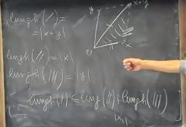

# Spazio R^n

Spazio $\mathbb{R}^n=\{x=(x_1,\dots,x_n)|x_1,\dots,x_n \in \mathbb{R} \}$

$\mathbb{R}^1$: retta reale
$\mathbb{R}^2$: piano cartesiano
$\mathbb{R}^2$: spazio ordinario

# Operazioni in R^n

1. somma $x=(x_1,\dots,x_n) \in \mathbb{R}^n$ ,$y=(y_1,\dots,y_n) \in \mathbb{R}^n$ $x+y:=(x_1+y_1, \dots, x_n+y_n)$  
2. moltiplicazione $x=(x_1,\dots,x_n) \in \mathbb{R}^n$ ,$\lambda \in \mathbb{R}^n$ $x\times \lambda:=(\lambda x_1, \dots,\lambda x_n)$  

## Prodotto scalare euclideo in R^n

**Def:** dati $x=(x_1,\dots,x_n) \in \mathbb{R}^n$ ,$y=(y_1,\dots,y_n) \in \mathbb{R}^n$, il prodotto scalare tra x e y **è il numero reale** $<x,y>:=(x_1\times y_1+ \dots+ x_n\times y_n) = \sum^n_{k=1} x_k\times y_k$  (notazione equivalente è $x \cdot y$)

**Proprietà**:
1. simmetrico $<x,y>= <y,x>$  
2. $\forall x,y,z \in \mathbb{R}^n, \forall \lambda,\mu \in \mathbb{R}$ vale $<\lambda x, \mu y, z>= \lambda<x,z>+ \mu <y,z>$
3. $\forall x \in \mathbb{R}^n$ vale  $<x,x> \geq 0$
    - (3 bis) $<x,x>=0 \implies x=\underline{0}$

## Vettori ordtogonali

**Def:** $x,y \in \mathbb{R}^n$ si dice che $x$ e $y$ sono ortogonali $<x,y>=0$

> NOTA:
> Sono ortagonali o quando uno di essi è zero o quando sono perpendicolari

## Norma vettore
**Def:** la norma di un vettore (lunghezza) $x \in \mathbb{R}^n$, $||x||=\sqrt{<x,x>}$

**proprietà**:
1. $\forall x \in \mathbb{R}^n, \lambda \in \mathbb{R}$ vale $|| \lambda x || = |\lambda| \times ||x||$
2.  $||x|| \geq 0, \forall x \in \mathbb{R}^n$  $||x||\leq 0 \iff x=0$
    - disuguaglianza tirangolare $\forall x,y \in \mathbb{R}^n$ $||x+y||\leq ||x||+||y||$

dimostrazione prop 1

$\sqrt{<\lambda x,\lambda x>} = \sqrt{\sum^n_{k=1} (\lambda x)^2}=\sqrt{\sum^n_{k=1} \lambda^2  (x)^2}= |\lambda| ||x||$

visualizzazione disuguaglianza triangolare

## Normalizzare un vettore

**Normalizzazione**:dato un $x\in \mathbb{R}^n \backslash {\underline{0}}$ cerco un $r>0$ tale che $||rx||=1$ applicando le proprietà 1 della norma del vettore $r=\frac{1}{||x||}$ 

> NOTA:
> con la normalizzazione possiamo scrivere un vettore come il prodotto scalare tra la norma e le sue coordinate polari 

esempio

dato un vettore x con un angolo di $\alpha$ è uguale a scrivere $||x||\times(\cos \alpha, \sin \alpha)$

### Disuguaglianza di couchy- schwarz

$\forall x ,y \in \mathbb{R}^n$ vale $|<x,y>| \leq |x| \times |y|$ vale "=" solo se x,y sono dipendenti

### Disuguaglianza triangolare

$\forall x ,y \in \mathbb{R}^n$ vale $|<x,y>| \leq |x| + |y|$ vale "=" solo se x,y sono dipendenti

dimostrazione

$|x+y|^2=|x|^2+|y|^2+2<x,y> \leq |x|^2+|y|^2+2<x,y>$ per la disuguaglianza di cauchy-shwarez
$\le|x|^2+|y|^2+2|x||y|$  ovvero $\leq (|x|+|y|)^2$

## Formula quadrato di un binomio

Dati $x,y \in \mathbb{R}^n$ $||x+y||^2=<x+y,x+y>=<x,x+y>+<y+x+y>=$ $<x,y>+<x,x>+<y,x>+<y,y>$ $=||x||^2+2<x,y>+||y||^2$

**Def**: dati $x,y \in \mathbb{R}^n$ la distanza tra $x,y$ è il numero della norma della differenza $||x-y||$ 

## Intorni specifici (dischi, palle) 

**def** $x \in \mathbb{R},r >0$  $B(x,r)=\{y \in \mathbb{R}^n / |y-x|<r\}$

 $n=1, x \in \mathbb{R},r >0$  $B(x,r)=\{y \in \mathbb{R}^n / |y-x|<r\}= ]x-r,x+r[$
 
 $n=2, x =(0,0)$  $B((0,0),r)=\{y \in \mathbb{R}^n / |(y_1,y_2)-(0,0)|<r\}= \sqrt{y_1^2+y_2^2}<r$

 $n=2, x =(0,0,0)=\underline{0}$  $B(\underline{0},r)=\{y \in \mathbb{R}^n / |(y_1,y_2)-(0,0)|<r\}= \sqrt{y_1^2+y_2^2}<r$

**Def**: $A \subseteq \mathbb{R}^n$ si dice limitato se $\exists R>0$ tale che $P\subseteq A$

## Insiemi aperti

**Def**: un insieme aperto sia $A \subseteq \mathbb{R}^n$. Si dice che $A$ è aperto se $\forall x \in A, \exists r>o$ tale che $B(x,r)\subseteq A$ 

$n=1 , A=]0,1[=\{x \in \mathbb{R}\space|\space 0<x<1\}$ $]a,b[$ è aperto $\forall a,b \in \mathbb{R}$ $]a,+\infty[$, $]-\infty,b[$ intervalli aperti

## Succcessioni in $\mathbb{R}^n$

una successione in $\mathbb{R}^n$ è una famiglia di $(x_k) k \in \mathbb{N}$ dove $x_k \in \mathbb{R}^n$ $\forall x \in \mathbb{N}5$ $x=(x_k^1,x_k^2,\dots,x_k^n) \in \mathbb{R}^n$ $\forall x \in \mathbb{N}$

**def** successione convergente $(x_k) k \in \mathbb{N}$ successioni in $\mathbb{R}^n, x \in \mathbb{R}^n$ .$\displaystyle \lim_{k \rightarrow \infty}x_k=x$ Si dice $\displaystyle \lim_{k \rightarrow +\infty} x^1_k = x^1 , \dots, \displaystyle \lim_{k \rightarrow +\infty} x^n_k = x^n$

**oss**: $(x_k)_{k \in \mathbb{N}},$ in $\mathbb{R}^n$ $x_k \to x \in \mathbb{R}^n \iff |x_k -x |\to 0$(con k che tende a +infinito)

**Funzioni di più variabili**
$A \subseteq \mathbb{R}^n, B \subseteq \mathbb{R}^q \space n,q \in \mathbb{N}$ $f:A\to B$

$Graf(f)=\{(x,f(x))\in A \times B\}$

Dato $E \subseteq A$,

$Im(E)=\{f(x)|x \in E\}$ 

Funzioni Scalarei 
- $q=1, A\subset \mathbb{R}^n , f:A \to \mathbb{R}$
- $n=1, q>1 I \subseteq \mathbb{R}, f:I \to \mathbb{R}^q$

**Def**(funzione continua) $A \subseteq \mathbb{R}^n, B\subset \mathbb{R}^q$  $f: A \to B$ Sia $\bar{x} \in A$ si dice f continua in $\bar{x}$ se $\forall (x_k)_{k \in \mathbb{N}}$ $\begin{cases}x_k \in A  \forall k \\ x_k \to \bar{x} \end{cases}$ vale $f(x_k) \to f(\bar{x})$  $k\to + \infty$ (convergenza in $\mathbb{R}^q$) 

Si dimostra che tutte le funzioni "elementari" sono continue

**oss** $f:A\to B$ è continua in $\bar{x}$ $\iff \forall \varepsilon  >0 \exists \delta_{\varepsilon}$ tale che $|f(y)-f(\bar{x})| < \varepsilon$ $\forall x \in A$ con $|y-\bar{x}|<\delta$

Si dimostra che se  $f_1,f_2,\dots,f_p:\mathbb{R}^n\to \mathbb{R}$ scalari sono continue, allora ogni insieme $A=\{x\in\mathbb{R}|f(x)_1<c_1,\dots,f(x)_p<c_p\}$

