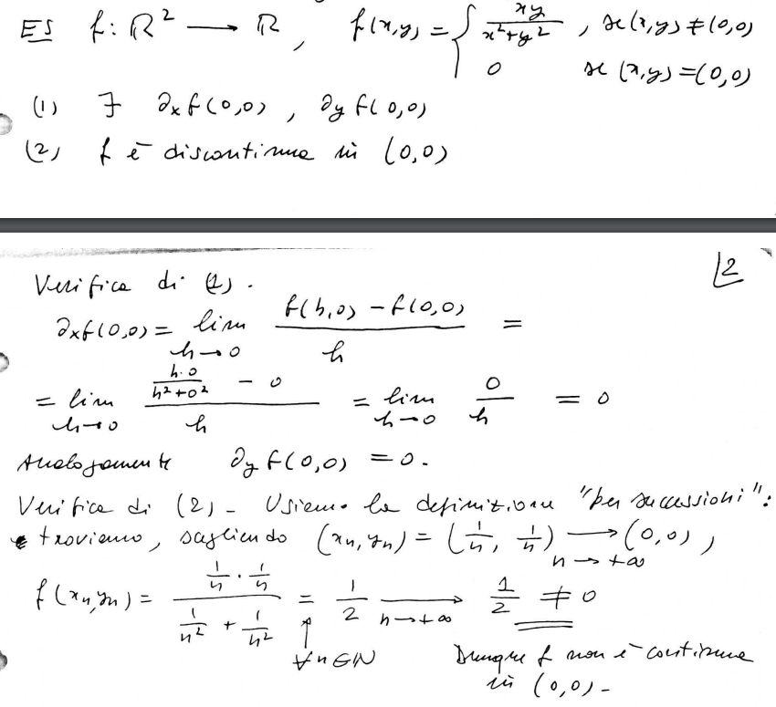
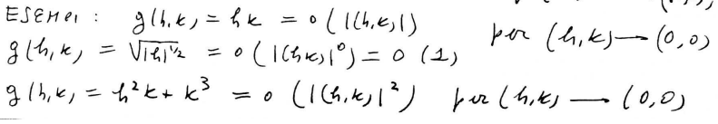

# Derivate parziali, Continuità e Derivabilità

## Derivata parziale

**Def**:$A \subset
$\frac{\delta f}{\delta x}(\bar{x},\bar{y})=$ $\displaystyle \lim_{h \rightarrow 0} \frac{f(\bar{x}+h,\bar{y})-f(\bar{x},\bar{y})}{h}$ ( e $\frac{\delta f}{\delta y}(\bar{x},\bar{y})=$ $\displaystyle \lim_{h \rightarrow 0} \frac{f(\bar{x},\bar{y}+h)-f(\bar{x},\bar{y})}{h}$ )
Se esistono i due limiti si chiama derivata parziale di f rispetto a x  ( nel punto $(\bar{x},\bar{y})$)

Notazioni

$\frac{\delta f}{\delta y}f(\bar{x},\bar{y})= D_y f(\bar{x},\bar{y})=\delta_y f(\bar{x},\bar{y})$

## Gradiente

**Def**(gradiente):Se $\exists D_x f$ e $\exists D_y f$ in $(\bar{x},\bar{y})$ allora $\nabla f(\bar{x},\bar{y})$ $=(D_x f(\bar{x},\bar{y}), D_y f(\bar{x},\bar{y}))$

esempio

$f(x,y)= xye^{-x^2}$ $D_x f= y D_x(xe^{-x^2})$
$=y[e^{-x^2}-2x^2 e^{-x^2}]=y(1-2x^2)e^{-x^2}$

$D_y f= xe^{-x^2}$ 

## Caso su n dimensioni

**Def**: (derivata parziale n-dimensioni)Se $A\subseteq \mathbb{R}^n$ dove $f:A \to \mathbb{R}^n$, $\bar{x}=(\bar{x}_1,\dots,\bar{x}_n) \in A$  e $j \in \{1, \dots, n\}$ poniamo $D_j f(\bar{x})=\delta_j f(\bar{x})=\frac{\delta f}{\delta x_j}(\bar{x})=$ $\displaystyle \lim_{h \rightarrow 0} \frac{f(\bar{x}+he_j)-f(\bar{x})}{h}$. (dove $e_j$ è definito come $e_1=(1,0,\dots,0)$, $e_2=(0,1,\dots,0),\dots$, $e_n=(0,0,\dots,1)$ )
 

## Derivabilità continuità 

Mentre nelle funzioni in da $\mathbb{R}$ a $\mathbb{R}$ la derivabilità $\implies$ continuità, dimostriamo che nelle **funzioni in $\mathbb{R}^n$ non è verificato.**

dimostrazione

## Differenziabilità

Riprendiamo prima alcuni concetti

### o piccolo 

**Def**: Sia $A \subseteq \mathbb{R}^2,$ un insieme aperto contentente $(0,0) \in A$, sia  $g:A \to \mathbb{R}$, e $p \ge 0$. Si scrive $g(h,k)=o(|(h,k)|^p)$ per $(h,k) \to (0,0)$ se  vale $\forall \varepsilon >0,\space \exists \delta >0$ tale che $\biggl |\frac{g(h,k)}{||(h,k)^p||}\biggr |<\varepsilon$ $\forall (h,k) \in A \cap B((0,0)\delta)$ 

esempi

### Definizione di Funzione differenziabile

> NOTA: in dimensione uno dire differenziabile e derivabile è la stessa cosa

**Def**:(funzione differenziabile) $A \subseteq \mathbb{R}^2$ aperto. $f:A\to \mathbb{R}, (\bar{x}$, $\bar{y})\in A$ si dice $f$ differenziale in $(\bar{x},\bar{y})\in A$ se:
1. $\exists \frac{\delta f}{\delta x} (\bar{x},\bar{y})$ e $\frac{\delta f}{\delta y} (\bar{x},\bar{y})\in \mathbb{R}$
2. Per ogni $(h,k)$ tale che $(\bar{x},\bar{y})+(h,k) \in A$ vale lo sviluppo  $f((\bar{x},\bar{y})+(h,k))=$ $f(\bar{x},\bar{y})+<\nabla f(\bar{x},\bar{y}),(h,k)>+o(|(h,k)|)$ per $(h,k) \to (0,0)$

**oss**: $f$ è  derivabile in $(\bar{x},\bar{y}) \in A \implies \space f$   continua in $(\bar{x},\bar{y})$

Formule Taylor per f del primo ordine con punto $(\bar{x},\bar{y})$ è $f(\bar{x},\bar{y})+D_x f(\bar{x},\bar{y})h + D_y f(\bar{x},\bar{y})k+o(|(|h,k)|)$

###  Taylor

$(\bar{x}+h,\bar{y}+k)=(x,y)$  
$\bar{x}+h=$(con h che tende a zero)$x\to\bar{x}$  
$\bar{y}+k=$(con k che tende a zero)$y\to\bar{y}$  

Taylor per F:

$f(x,y)=f(\bar{x},\bar{y})+f<\nabla(\bar{x},\bar{y}),(x-\bar{x},y-\bar{y})>+o(|(x-\bar{x},y-\bar{y})|)$   

$T_1(x,y)=f(\bar{x},\bar{y})+f<\nabla(\bar{x},\bar{y}),(x-\bar{x},y-\bar{y})>$  
$T_1=$ Pol. Taylor 1° ordine  

Il piano di equazione $Z=T_1(x,y)$ si chiama piano tangente al grafico di $f$ in $(\bar{x},\bar{y},f(\bar{x},\bar{y}))$ (se si immagina una curva nello spazio si può immaginare il piano tangente come un cartoncino appoggiato su un punto della curva)

esempio

$f(x,y)=\sqrt{1+xy^2}$ $(\bar{x},\bar{y})=(2,-1)$

$D_x f=\frac{y^2}{2\sqrt{1+xy^2}}$  
$D_y f=\frac{2xy}{2\sqrt{1+xy^2}}$  

$f(2,-1)=\sqrt{3}$

$\nabla f(2,-1)=(\frac{y^2}{2\sqrt{1+xy^2}},\frac{2xy}{2\sqrt{1+xy^2}})$ $=(\frac{1}{2\sqrt{3}},\frac{-2}{\sqrt{3}})$    
$T_1(x,y)=f(2,1)+<\nabla f(2,-1),(x-2,y+1)>=\sqrt{3}+\frac{1}{2\sqrt{3}}(x-2)-\frac{-2}{\sqrt{3}}(y+1)$  

$z=T_1(x,y)$ eq paino tangente

**oss** $f:A \to \mathbb{R}$ A aperto di $\mathbb{R}^2$, e se $f$ è differenziabile in $(\bar{x},\bar{y})\implies f$  è continua in $(\bar{x},\bar{y})$

Verifica

bisogna vedere che $\forall (h_n,k_n) \to (0,0)$ (per ogni successione che tende a 0,0) vale $f(\bar{x}+h_n,\bar{y}+k_n)\to f(\bar{x},\bar{y})$ (con $n \to \infty$)  
Sia $(h_n,k_n)\to (0,0)$ Taylor $f(\bar{x}+h_n+\bar{y}+k_n)-f(\bar{x},\bar{y})=<\nabla f(\bar{x},\bar{y}),(h_n,k_n)>+o(|(h_n,k_n)|)$

## Condizioni sufficienti di differenziabilità

**Def** $A \subseteq \mathbb{R}^2$ aperto, $f: A \to \mathbb{R}$ si dice che $f$ è di classe $C^1 (A)$ se  $\exists D_x f, D_y f$ in ogni punto di A e in oltre sono continue in A

> NOTA:
> si dimostra che le funzioni "elementari",sono continue nei loro domini

**Lemma**: Se $f$ è $C^1(\mathbb{R}^2)$, dati $(\bar{x},\bar{y})\in \mathbb{R^2}$ e $h,k \in \mathbb{R}$ allora $\theta_1,\theta_2 \in ]0,1[$ tali che:
1.$f(\bar{x}+h,y)-f(\bar{x},\bar{y})=D_x f(\bar{x}+\theta_1 h_1,\bar{y})h$
2. $f(\bar{x},\bar{y}+k)-f(\bar{x},\bar{y})=D_y f(\bar{x},\bar{y}+\theta_2k)k$

dimostriamo il punto 2

$g(t)=f(\bar{x},t)$ per $t \in \mathbb{R}$

$g(\bar{y}+k)-g(\bar{y})=f(\bar{x},\bar{y}+k)-f(\bar{x},\bar{y})$

**Lagrange**

$g'(t)=\displaystyle \lim_{s \rightarrow 0} \frac{g(t+2)-g(t)}{s}=$
$\displaystyle \lim_{s \rightarrow 0} \frac{f(\bar{x},t+s)-f(\bar{x},t)}{s}$ $=\frac{\delta f}{\delta x} (\bar{x},t)\implies g'(t)=D_y f(\bar{x},t)$ per ipotesi g' esiste ed è anche continua

Uso Lagrange per g con $\bar{y}$ e $\bar{y}+k$

$\exists \theta \in ]0,1[$ tale che $g(\bar{y}+k)- g(\bar{y})=g'(\bar{y}+\theta)k$  che è uguale a dire $f(\bar{x},\bar{y}+k)-f(\bar{x},\bar{y})= D_y f(\bar{x}+\theta_2 k)$

**Teorema**: $A \subseteq \mathbb{R}^2$, aperto $f:A \to \mathbb{R}$. se $f$ è $C^1(A)$ allora $f$ è differenziali in ogni $(\bar{x},\bar{y})\in A$ , $f(\bar{x}+h,\bar{y}+k)-f(\bar{x},\bar{y})=<\nabla f(\bar{x},\bar{y}),(h,k)>+o(|(h,k)|)$

Dimostrazione

$A=\mathbb{R}, f \space C^1(\mathbb{R}^2),(\bar{x},\bar{y})\in \mathbb{R}^2$ sia $(h,k)\in \mathbb{R}^2$ 

Utilizziamo Taylor

$f(\bar{x}+h,\bar{y}+k)-f(\bar{x},\bar{y})=$ $f(\bar{x}+h,\bar{y}+k)-f(\bar{x}+h,\bar{y})+f(\bar{x}+h,\bar{y})-f(\bar{x},\bar{y})$

ora applichiamo il lemma, prima per $f(\bar{x}+h,\bar{y}+k)-f(\bar{x}+h,\bar{y})$ e poi per $f(\bar{x}+h,\bar{y})-f(\bar{x},\bar{y})$

(2) $f(\bar{x}+h,\bar{y})-f(\bar{x},\bar{y})$ $\exists \theta_1 \in ]0,1[$ tali che $D_x f(\bar{x})+ \theta _1 h, \bar{y})h$  $\exists \theta_2 \in ]0,1[$ tale che 
1. $f(\bar{x}+h,\bar{y}+k)- f(\bar{x}+h,\bar{y})=D_y f(\bar{x}+h,\bar{y}+\theta_2 k)k$

Dunque abbiamo $\exists \theta_1,\theta_2 \in ]0,1[$ $f(\bar{x}+h,\bar{y}+k)-f(\bar{x},\bar{y})=D_x f(\bar{x}+\theta_1h,\bar{y}h)+D_y f(\bar{x}+h,\bar{y}+\theta_2 k)k$

Mostriamo che
1. $D_x f(\bar{x},\bar{y})h+o(|(h,k)|)$
2. $D_y f(\bar{x},\bar{y})k+o(|(h,k)|)$

Prima affermazione $\iff D_x [f(\bar{x}+\theta_1 h,\bar{y})- D_x f(\bar{x},\bar{y})]h=o(|(h,k)|)$

$\forall \varepsilon >0 \exists \delta >0$ tale che $\frac{|[D_x f(\bar{x}+\theta_1 h,\bar{y})-D_x f(\bar{x},\bar{y})]h|}{|(h,k)|}<\varepsilon$ $0<|(h,k)|<\delta$ $|D_x f(\bar{x}+\theta+h,\bar{y})- D_x f(\bar{x},\bar{y})| |\frac{h}{(h,k)}| \le |D_x f(\bar{x}+\theta_1 h, \bar{y})-D_x f(\bar{x},\bar{y})|<\varepsilon$

se prendiamo $\varepsilon >0,\delta$ verra fuori questo delta che dalla continuità $D_x f$ in $(\bar{x},\bar{y}) \implies$
$|D_x f(\bar{x}+\theta_1 h, \bar{y})-D_x f(\bar{x},\bar{y})|<\varepsilon$ $\forall (y,v) \in B((\bar{x},\bar{y}),\delta)$

es

$f(x,y)= \sin(x^2+xy)$  $(\bar{x},\bar{y})=(-\sqrt{\frac{\pi}{4}},0)$

$f(-\sqrt{\frac{\pi}{4}},0)=\sin(\sqrt{\frac{\pi}{4})}=\frac{1}{\sqrt{2}}$

$D_x f(x,y)=\cos(x^2+xy)+ D_x(x^2+xy)=\cos(x^2+xy)+2x+y$
$D_y f(x,y)=\cos(x^2+xy)+ D_y(x^2+xy)=\cos(x^2+xy)+x$

$\nabla f(-\frac{\pi}{4},0)=(-\sqrt{\frac{\pi}{2}},-\frac{1}{2}\sqrt{\frac{\pi}{2}})$

$T_1(x,y)=f(-\frac{\sqrt{\pi}}{2},2)+<\nabla f(-\sqrt{\frac{\pi}{4}},0),(x+\sqrt{\frac{\pi}{4}},y)>$
$=\frac{1}{\sqrt{2}}+<\nabla (-\sqrt{\frac{\pi}{2}},-\frac{1}{2}\sqrt{\frac{\pi}{2}}),(x+\sqrt{\frac{\pi}{4}},y)>$

Formula di Taylor:

$f(x,y)=T_1(x,y)+o(|(x+\frac{\sqrt{\pi}}{2},y)|)$ per $(x,y) \to (-\frac{\sqrt{\pi}}{2},0)$

$z=T_1(x,y)$ equazione piano tangente $=\{(x,y,z) \in \mathbb{R}^3 / z= T_1(x,y)\}$

