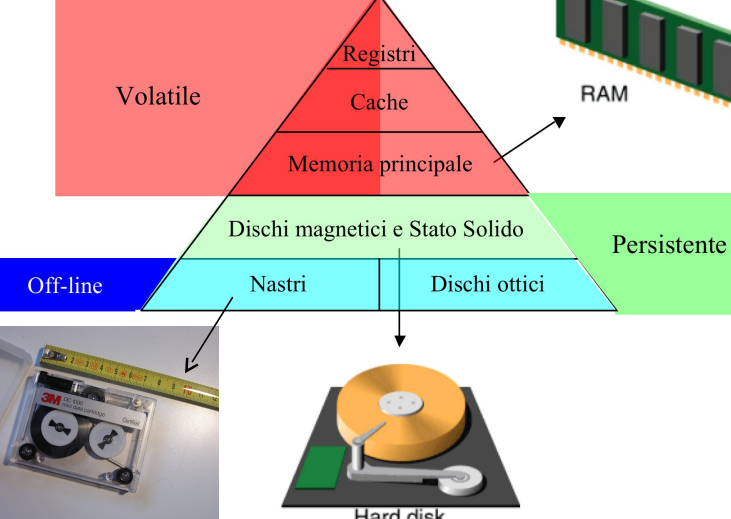

- [1. Introduzione](#1-introduzione)
  - [1.1. Libri](#11-libri)
  - [1.2. Esame](#12-esame)
- [2. Livelli](#2-livelli)
  - [2.1. Livello 0](#21-livello-0)
    - [2.1.1. Porte logiche](#211-porte-logiche)
  - [2.2. Livello 1](#22-livello-1)
  - [2.3. Livello 2](#23-livello-2)
  - [2.4. Livello 3-4](#24-livello-3-4)
  - [2.5. Linguaggi 5](#25-linguaggi-5)
- [3. Elaboratori](#3-elaboratori)
  - [3.1. Storia degli Elaboratori](#31-storia-degli-elaboratori)
- [4. Organizzazione degli Elaboratori](#4-organizzazione-degli-elaboratori)
  - [4.1. CPU](#41-cpu)
    - [4.1.1. Unita di controllo](#411-unita-di-controllo)
  - [4.2. ALU](#42-alu)
  - [4.3. Ottimizzazioni](#43-ottimizzazioni)
  - [4.4. Le Memorie](#44-le-memorie)
    - [4.4.1. Memoria cache](#441-memoria-cache)

# 1. Introduzione

docente
:  Ivan Lanese  

[materiale](https://virtuale.unibo.it/course/view.php?id=30691)

## 1.1. Libri

- Architettura dei calcolatori. Un approccio strutturale

[DA SCARICARE](http://www.nand2tetris.org)

## 1.2. Esame

- esame scritto (27 punti) dove si avranno punti bonus per i progetti (max. 6) e per li interventi

# 2. Livelli

Nell'informatica si usano i principi di astrazione e implementazione, per diminuire la complessità, l'astrazione grazie a delle interfaccia accede alle implementazione (che utilizzando l'astrazione non bisogna più sapere com'è costruita)

> astrazione: Si presenta la soluzione ad un problema concentrandosi solo su alcuni aspetti “rilevanti” (ad esempio, come ottenere la soluzione componendo soluzioni di problemi più semplici)

> Implementazione: Si realizza la soluzione aggiungendo gli aspetti astratti nella prima fase (ad esempio, si mostra come si possono risolvere i problemi più semplici)

questa implementazione e astrazione è utilizzata per creare macchine multilivello

nella tipica struttura a livelli, ogni livello superiore esegue il codice su una macchina virtuale inferiore eseguendo:
- un interprete che viene eseguito eseguito su una macchina inferiore
- una traduzione nel linguaggio di una macchina inferiore

Tipico elaboratore a 6 livelli 

## 2.1. Livello 0

### 2.1.1. Porte logiche 

hanno tutti due input

un circuito si scrive anche con una tabella di verità

>`tabella di verità` mappa tutti gli input con i risultato l'output (ha $2^n$ righe)

(si costruirà tutto partendo dalla porta NAND, e utilizzando solo questo circuito)

> NAND: 
> il circuito NAND ha la tabella di verità come un and negato
> (si usa la NAND perché si possono realizzare tutte le porte logiche)

> Circuiti combinatori :
>  Sono circuiti che con lo stesso set di input input  producono lo stesso output

> Circuiti Sequenziali :
> Circuiti che cambiano l'output in base agli input ricevuti in passato

## 2.2. Livello 1

>Microarchitettura :
> governa il flusso dei dati fra i vari componenti del livello logico digitale

## 2.3. Livello 2

> Istruzioni macchina :
> insieme di istruzioni eseguibili dalla microarchietettura

## 2.4. Livello 3-4 

> sistema operativo:
> fornisce la gestione di risorse ed esecuzione dei processi

> linguaggio assembly:
> permette di programmare i livelli sottostanti

## 2.5. Linguaggi 5

> Linguaggi di programmazione ad alto livello:
> linguaggi che vengono compilati o interpretati, in linguaggio assembly

# 3. Elaboratori

sono macchine multi-livello, e si utilizzano le astrazioni, e ogni volta vengono eseguiti o tradotti in nella astrazione sottostante 

## 3.1. Storia degli Elaboratori

> non sono per l'esame

1. Pascalina: prima macchina del 1600 che faceva da calcolatrice
2. Analytical Engine: riusciva a fare somme con 50 cifre e una memoria di 1000 parole, ed è considerato il primo computer però non è stato mai costruito
3. colossus:si passa alle valvole al posto dei relè, ed è il primo computer funzionante
4. EINAC: misto tra relè e valvole, usato per scopi militari, si programmava cambiando i cavi e le schede perforate come input
5. IAS: progetto di un calcolatore, con la struttura che ancora viene utilizzata (formata da una memoria, una unità di controllo, unita aritmetico logica  e un input e output)
6. PDP-1: c'è il passaggio ai transistor, primo calcolatore ad avere un riscontro sul mercato, per la prima volta con un display
7. CDC 6600: è il primo calcolatore che poteva eseguire istruzioni in parallelo
8. IBM 360: multi programmazione (in memoria poteva avere più di un programma), diventa ancora più economico e si poteva comprare con diverse potenze
9. VLSI: è un cip con milioni di transistor (i precessori dei giorni nostri)
10. IBM 5150: primo personal computer che raggiungerà una veloce diffusione
11. Osborne1 il primo computer portatile
12. macintosh: primo con l'interfaccia grafica (senza lo schermo totalmente testuale)

il computing non è solo nel computer ma in molti altri oggetti

>**MIPS**: milioni di operazioni al secondo

>**MFLOPS**: miliardi di operazioni a virgola mobile

# 4. Organizzazione degli Elaboratori

> "bus oriented": un bus è un insieme di connessioni elettriche per collegare i vari componenti

IL bus a differenza dello schema di van Neumann, non ha una connessione punto a punto ma tutti i componenti sono collegati al bus 

Una altra novità è che con von Neumann la memoria non solo per i dati ma anche per i programmi 

La cpu e la memoria utilizzano i **bus dati** e il **bus indirizzi** per scambiarsi le informazioni

## 4.1. CPU

> la cpu è il cervello della macchina che esegue i calcoli

**la cpu è composta da**:
- unita di controllo:legge e interpreta le istruzioni 
- alu: esegue le operazioni
- registri: che sono delle celle di memoria per i dati necessari al funzionamento

> [NOTA]
> la memoria centrale è più lenta del processore, e come primo accorgimento si utilizzano i registri per tenere i dati più utilizzati

**Registri Speciali**(non "general propose" di uso generale):
- Program Counter:indica la prossima istruzione
- Instruction Register: contiene l'istruzione che stiamo eseguendo (prende tutta l'istruzione per esempio prende tutto `add ax,bx`)
- Memory registers:si usano per interagire con la memoria
    - Memory address Register: su questo si mette l'indirizzo da leggere o scrivere  
    - Memory data Register: qui si scrive li dato da scrivere o si legge il dato appena letto
- Program Status Word: indica informazioni sull'andamento dell'ultima istruzione eseguita (c'è stata un'overflow, l'ultima operazione è risultata zero)

**Esempio pratico dell'esecuzione di un istruzione**  
1. il contenuto di Program counter viene messo su Memoriy address Register e viene letta l'istruzione
2. la memoria copia il contenuto della cella all'indirizzo del Memory address register su il Memory Data Register
3. il contenuto di Memory Data Register viene copiato su Instruction Register
4. l'istruzione passa all'ALU
5. se ci sono operatori da prelevare in memoria si collegano a i registri (utilizzando sempre il Memory Address Register e il Memory Data Register)
6. termina l'esecuzione e il risultato va sul registro di destinazione (aggiorna il Program Status Word), e se bisogna scrivere la memoria scrive in memoria il valore calcolato si sposta sulla memoria utilizzando sempre il MDR e il MAR
7. si torna al punto 1 dopo avere aggiornato il valore di Program Counter

>[NOTA]
> il program counter viene incrementato in modo diverso dal tipo di architettura, alcuni sistemi hanno una dimensione fissa dell'istruzione e a quel punto incrementa di una costante, in altri casi quanto si hanno diversa lunghezza nelle istruzioni un circuito nel processore sa di quanto incrementare in base all'istruzione eseguita

il ciclo di esecuzione può essere schematizzato anche come **FDE**:
1. **Fetch**  caricamento della memoria di un'istruzione (punti 1-2 dell'esempio)
2. **Decode** identificazione del tipo di operazione da eseguire (punto 3) 
3. **Execute** effettuazione delle operazioni corrispondenti all'istruzione (punti 4-5-6)

### 4.1.1. Unita di controllo

> l'unita di controllo gestisce la memoria e l'alu, e interpreta le istruzioni

i tipi di set di istruzioni possono essere:
- CISC: Complex Instruction Set Computer, e quindi utilizzare microprogrammazione e un processore più complesso
- RISC: Reduced Instruction Set Computer, istruzioni più semplici possono essere eseguite più velocemente e potendo evitare la microprogrammazione

di solito in una cpu CISC c'è un collegamento diretto tra il MDR e l'alu senza passare dai registri, mentre nei RISC non c'è il collegamento diretto

## 4.2. ALU

> alu esegue le operazioni

> Data Path: è la parte della CPU comprendete ALU, is uoi input e i suoi output

nel calcolatore c'è un segnale che si chiama clock, che è un segnale regolare che da il tempo ad  al data path (un operazione può utilizzare anche più cicli di clock)

## 4.3. Ottimizzazioni

Metodi per velocizzare la cpu:
- **pipelining**:Un modo per migliorare le prestazioni di un processore è eseguire contemporaneamente più cicli FDE, usando per ognuno di essi parti diversi della CPU
- **Multicore**:In alcuni casi, all’interno della medesima CPU si replicano unità di controllo e ALU per esecuzioni di attività in parallelo
- **Parallelismo**:com molte cpu che lavorano in coordinamento
    - SIMD i processori eseguino la stessa istruzione su dati diversi, possiamo utilizzare il SIMD (così utilizza più alu ma con con una sola control unit, si torova spesso nelle GPU) (cambia il numero di alu e di registri)
    - MIMD: sono più precessori che condividono la stessa memoria senza eseguire necessariamente la stessa istruzione
- **multicomputer**: molti processi non condividono una memoria e che comunicano scambiandosi messaggi, così moltissime cpu possono cooperare

 

pipelining

è l'implementazione di una catena di montaggio dentro la cpu

viene divisa l'esecuzione di un operazione in più step così mentre si sta eseguendo un operazione allo stato 2 nello stadio 1 si può incominciare un altra operazione

essendo che suddividiamo l'operazioni in vari passi, possiamo diminuire il ciclo di clock per ogni di questi stage

## 4.4. Le Memorie

in ordine di velocità:

- **Volatile**: l’informazione rimane memorizzata fino a che il calcolatore è alimentato
- **Persistente**: l’informazione rimane memorizzata anche quando il calcolatore non è alimentato (spento)
- **On-line**: i dati sono sempre accessibili
- **Off-line**: il supporto deve essere montato per poter accedere ai dati

> le memorie si organizzano in celle (ogni cella contiene un bit)

- byte o uno o zero
- bit 8 bit
- word è uguale al blocco con il quale il calcolatore lavora (quanti bit ha la cpu), per memorizzare le word in un byte si può memorizzare in big endian o end endian

### 4.4.1. Memoria cache

> la cache è una memoria volatile poco capiente ma molto veloce

se la cpu accedesse la ram in indirizzi casuale al cache non servirebbe, molti programmi però utilizzano pezzi di memoria vicini e in questi casi la cache velocizza le operazioni.

**tempo medio d'accesso** = $c+(1-h)m$ 

    

    spiegazione    
    

quantificare l'impatto della cache:
- c sia il tempo di accesso alla cache
- m sia il tempo di accesso alla memoria centrale
- h sia l'hit-radio, la frazione di riferimenti che può essere soddisfatta dalla cache (una frazione che ci indica quante volte la cache riesce a non far accedere alla memoria)

