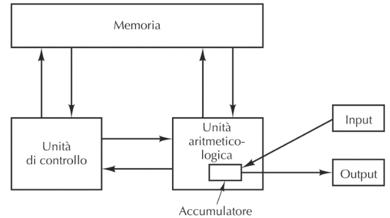
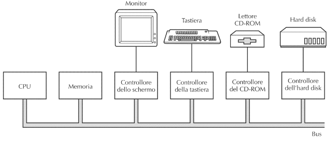
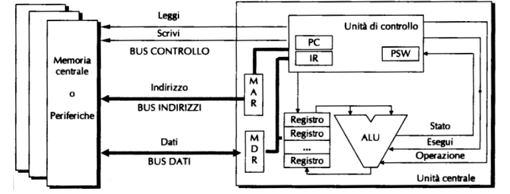
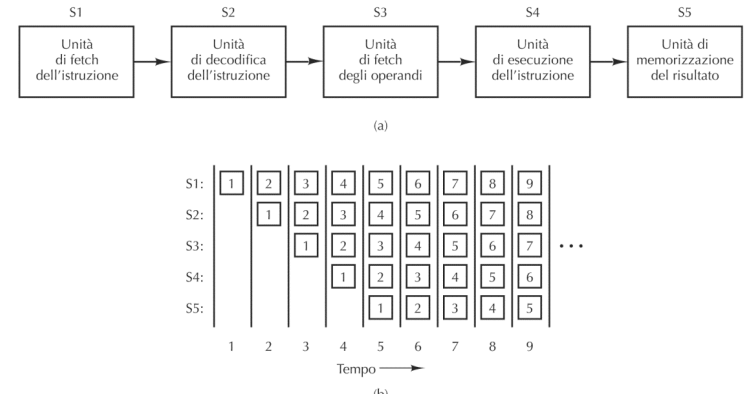
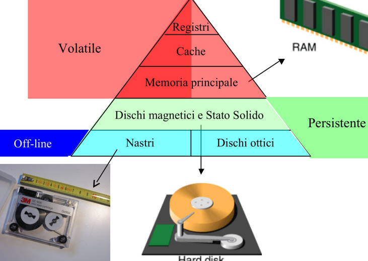
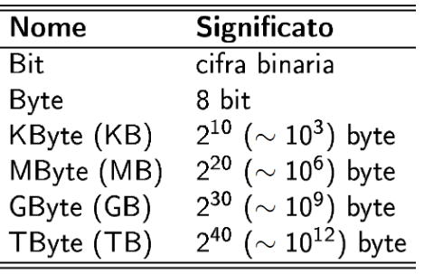
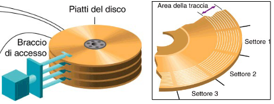

# Organizzazione degli Elaboratori

> "bus oriented": un bus è un insieme di connessioni elettriche per collegare i vari componenti

IL bus a differenza dello schema di van Neumann, non ha una connessione punto a punto ma tutti i componenti sono collegati al bus 

Una altra novità è che con von Neumann la memoria non solo per i dati ma anche per i programmi 

La cpu e la memoria utilizzano i **bus dati** e il **bus indirizzi** per scambiarsi le informazioni

i dispositivi si **collegano al bus tramite controller**, alcuni controller accedono direttamentente alla memoria, e al termine della scrittura/lettura invia un segnale alla cpu

il bus collega anche le periferiche, l'accesso al bus condivisio viene gestito da un "albitro" del bus

i nuovi dispositivi, possono trasferire i dati dalla memoria ad un altro dispositivo senza passare dalla cpu (che da l'ordine solo da che indirizzo a quale copiare)

## 4.1. CPU

> la cpu è il cervello della macchina che esegue i calcoli

**la cpu è composta da**:
- unita di controllo:legge e interpreta le istruzioni 
- alu: esegue le operazioni
- registri: che sono delle celle di memoria per i dati necessari al funzionamento

> [NOTA]
> la memoria centrale è più lenta del processore, e come primo accorgimento si utilizzano i registri per tenere i dati più utilizzati

**Registri Speciali**(non "general propose" di uso generale):
- Program Counter:indica la prossima istruzione
- Instruction Register: contiene l'istruzione che stiamo eseguendo (prende tutta l'istruzione per esempio prende tutto `add ax,bx`)
- Memory registers:si usano per interagire con la memoria
    - Memory address Register: su questo si mette l'indirizzo da leggere o scrivere  
    - Memory data Register: qui si scrive li dato da scrivere o si legge il dato appena letto
- Program Status Word: indica informazioni sull'andamento dell'ultima istruzione eseguita (c'è stata un'overflow, l'ultima operazione è risultata zero)

**Esempio pratico dell'esecuzione di un istruzione**  
1. il contenuto di Program counter viene messo su Memoriy address Register e viene letta l'istruzione
2. la memoria copia il contenuto della cella all'indirizzo del Memory address register su il Memory Data Register
3. il contenuto di Memory Data Register viene copiato su Instruction Register
4. l'istruzione passa all'ALU
5. se ci sono operatori da prelevare in memoria si collegano a i registri (utilizzando sempre il Memory Address Register e il Memory Data Register)
6. termina l'esecuzione e il risultato va sul registro di destinazione (aggiorna il Program Status Word), e se bisogna scrivere la memoria scrive in memoria il valore calcolato si sposta sulla memoria utilizzando sempre il MDR e il MAR
7. si torna al punto 1 dopo avere aggiornato il valore di Program Counter

>[NOTA]
> il program counter viene incrementato in modo diverso dal tipo di architettura, alcuni sistemi hanno una dimensione fissa dell'istruzione e a quel punto incrementa di una costante, in altri casi quanto si hanno diversa lunghezza nelle istruzioni un circuito nel processore sa di quanto incrementare in base all'istruzione eseguita

il ciclo di esecuzione può essere schematizzato anche come **FDE**:
1. **Fetch**  caricamento della memoria di un'istruzione (punti 1-2 dell'esempio)
2. **Decode** identificazione del tipo di operazione da eseguire (punto 3) 
3. **Execute** effettuazione delle operazioni corrispondenti all'istruzione (punti 4-5-6)

### Unita di controllo

> l'unita di controllo gestisce la memoria e l'alu, e interpreta le istruzioni

i tipi di set di istruzioni possono essere:
- **CISC**: Complex Instruction Set Computer, e quindi utilizzare microprogrammazione e un processore più complesso
- **RISC**: Reduced Instruction Set Computer, istruzioni più semplici possono essere eseguite più velocemente e potendo evitare la microprogrammazione

di solito in una cpu CISC c'è un collegamento diretto tra il MDR e l'alu senza passare dai registri, mentre nei RISC non c'è il collegamento diretto

##  ALU e clock

> alu esegue le operazioni

> **Data Path**: intendiamo la parte della CPU comprende ALU, i suoi input ed i suoi output(registri)

nel calcolatore c'è un segnale che si chiama **clock**; è un segnale regolare che **determina il tempo di Data Pah** (un operazione può utilizzare anche più cicli di clock)

**Velocità CPU**:
- il ciclo del clock (stessa durata ciclo di data pah) può essere calcolato $\frac{1}{F}$ (dove F è la frequenza)
- durata di un istruzione può essere calcolata n*durata ciclo di path (n varia da istruzione a istruzione)

##  Ottimizzazioni

Metodi per velocizzare la cpu:
- **pipelining**:Un modo per migliorare le prestazioni di un processore è eseguire contemporaneamente più cicli FDE, usando per ognuno di essi parti diversi della CPU
- **Multicore**:In alcuni casi, all’interno della medesima CPU si replicano unità di controllo e ALU per esecuzioni di attività in parallelo
- **Parallelismo**:com molte cpu che lavorano in coordinamento
    - SIMD i processori eseguino la stessa istruzione su dati diversi, possiamo utilizzare il SIMD (così utilizza più alu ma con con una sola control unit, si torova spesso nelle GPU) (cambia il numero di alu e di registri)
    - MIMD: sono più precessori che condividono la stessa memoria senza eseguire necessariamente la stessa istruzione
- **multicomputer**: molti processi non condividono una memoria e che comunicano scambiandosi messaggi, così moltissime cpu possono cooperare

### approfondimento pipelining

è l'implementazione di una catena di montaggio dentro la cpu

viene divisa l'esecuzione di un operazione in più step così mentre si sta eseguendo un operazione allo stato 2 nello stadio 1 si può incominciare un altra operazione

essendo che suddividiamo l'operazioni in vari passi, possiamo diminuire il ciclo di clock per ogni di questi stage

## Le Memorie

in ordine di velocità:  

- **Volatile**: l’informazione rimane memorizzata fino a che il calcolatore è alimentato
- **Persistente**: l’informazione rimane memorizzata anche quando il calcolatore non è alimentato (spento)
- **On-line**: i dati sono sempre accessibili
- **Off-line**: il supporto deve essere montato per poter accedere ai dati

> le memorie si organizzano in celle (ogni cella contiene un bit)

**word** è uguale al blocco con il quale il calcolatore lavora (quanti bit ha la cpu), per memorizzare le word in un byte si può memorizzare in big endian o end endian

###  Memoria cache

> la cache è una memoria volatile poco capiente ma molto veloce

se la cpu accedesse la ram in indirizzi casuale al cache non servirebbe, molti programmi però utilizzano pezzi di memoria vicini e in questi casi la cache velocizza le operazioni.

**tempo medio d'accesso** = $c+(1-h)m$ 

**spiegazione**  
quantificare l'impatto della cache:
- c sia il tempo di accesso alla cache
- m sia il tempo di accesso alla memoria centrale
- h sia l'hit-radio, la frazione di riferimenti che può essere soddisfatta dalla cache (una frazione che ci indica quante volte la cache riesce a non far accedere alla memoria)

###  Hard Disck

> hard disk (HD): è un dispositivo elettro-meccanico per la conservazione di informazioni sotto forma magnetica

- **Testina**: magnetizza e legge lo stato di magnetizzazione della superficie del disco
- **Traccia**: sequenza circolare di bit
- **Settore**: porzione di traccia che contiene una quantità prefissata di bit (uguale per tutti i settori)

### Memorie a Stato Solido

> si tratta di dispositivi completamente elettronici senza parte in movimento (consumano meno energia e maggiore resistenza agli urti rispetto agli hard disck )

### Velocizzare le Memorie

> RAID: tecnica che utilizza più dischi in parallelo per aumentare le prestazioni e diminuire il data lost

Più veloce perché si leggono più dati contemporaneamente, più affidabile se si replicano i dati e si aggiungono bit di controllo per verificare/correggere errori

### Dischi Ottici

> Dischi Ottici: dischi in cui un laser legge e scrive le informazioni

vengono scritti e letti tramite fori (pit) e con delle zone piane (lend)

### Oltre le memorie

ci sono i dispositivi di input e output (stampanti, tastiera, schermo,mouse, schede di rete, etc..)

**monitor**: deve essere molto veloce e ha una gran quantità di dati, ogni pixel richiede 32bit (in uno schermo normale 1920x1080 66 milioni di bit)

Negli anni si sono sviluppati processori solo per la gestione dello schermo (GPU) 

