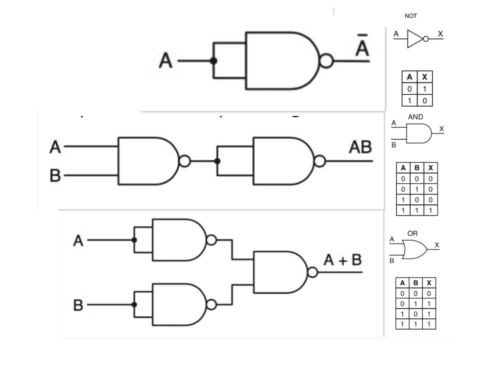

# 5. Porte Logiche e Circuiti Combinatori

> Porte Logiche:hanno 1/2 ingressi (che possono essere scambiati) e un uscita

Ogni Porta Logica e circuito combinatorio può essere descritto tramite la tabella di verità

**es**  
passare da $A+\bar{A}=1$ a $A\bar{A}=0$ utilizzando de morgan law

## 5.1. Funzioni booleane e tabelle di verità

> Un **mintermine** su n variabili è l’AND fra n letterali corrispondenti alle n variabili

Ogni combinazione delle variabili di una funzione booleana ha un corrispondente mintermine (vero per quella specifica combinazione) ogni tabella di verità ha $2^n \text{mintermini}$ dove n è il numero di letterali.

> la **forma canonica** è una funzione booleana, che si ricava concatenando con l'or i mintermini per cui la funzione è verificata

Per esempio la forma canonica della funzione definita nell'immagine sopra è : $\bar{A}B\bar{C}+AB\bar{C}+ABC$

## 5.2. Implementare Funzioni Booleane

Creaiamo dei circuiti che rappresentano fisicamente le nostre funzioni booleane.
Per creare tutte le nostre funzioni booleane possiamo partire dalla porta NAND, infatti con questa porta si riescono ad implementare tutte le porte logiche (AND,OR e NOT). Inoltre la porta NAND è molto facile da implementare fisicamente.

**Xor**:è vero solo se i due input sono diversi

**Multiplexer**: ha 3 input, il terzo input decide quale dei due input far passare

**es**  
fare la tabella di verità su $A+ \overline{ (A+C) } B$

$A+ \overline{ (B+C) } B$  
$A+\bar{B}\bar{C}B$  
$A+0$

## 5.3. Mappe di Karnaugh

> sono un modo per rappresentre le funzioni booleane, e restituisce una funzione che è unguale o più piccola di quella canonica

**mappa per due variabili**

| B \ A | 0 | 1 |
|-----|---|---|
| 0   |   |   |
| 1   |   |   |

**mappa per tre variabili** (notare quando ci sono più variabili ordiniamo i numeri con il gray code)

| B \ AC |00| 01 | 11 | 10 |
|-----|---|---|---|---|
| 0   |   |   |   |   |
| 1   |   |   |   |   |

**mappa con quattro variabili**

| DB \ AC |00| 01 | 11 | 10 |
|-----|---|---|---|---|
| 00 |   |   |   |   |
| 01 |   |   |   |   |
| 11 |   |   |   |   |
| 10 |   |   |   |   |

possiamo racchiudere gli uno nella tabella in rettangoli con base e altezza che sono potenze di 2.

**Copertura minimale**:è una delle forme più piccole
- raggruppamenti che non sono contenuti in potenziali raggruppamenti più grandi
- raggruppamenti che contengono almeno una cella che non appare anche in altri raggruppamenti della copertura

L’espressione booleana corrispondente ad una copertura minimale risulta essere un’espressione del tipo somma di prodotti di letterali (in altri termini OR fra AND di letterali) con un numero minimale di addendi.
