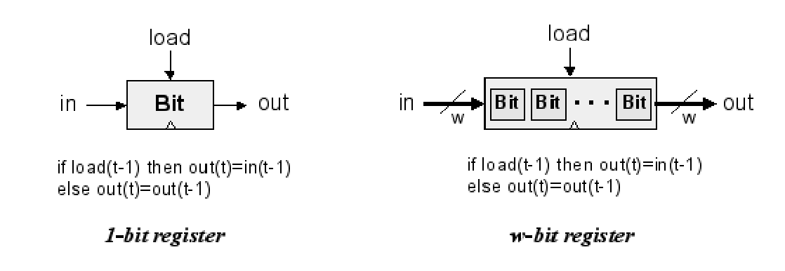

# Circuiti sequenziali

I **circuiti sequenziali** sono circuiti il cui risultato cambia in base agli input presi in passato

## Latch SR


**creiamo la tabella di verità**  
- Se S=1, R=0 allora Q=1, $\bar{Q}$=0
- Se S=0, R=1 allora Q=0, $\bar{Q}$=1
- Se S=1, R=1 allora Q=0, $\bar{Q}$=0
- Se S=0, R=0 allora ... non si sa!

Essendo che nel caso S=0,R=0 gli output rimangono invariati.
Ma se il circuito come primo input ha S=0,S=0 allora non si sa se Q è 0 o 1.


## Latch SR temporizzato


Di solito si utilizza un clock per fare in modo che il Latch non cambi valore in momenti non opportuni.

## Latch D temporizzato


Questo latch D, fa in modo che non possiamo mai avere la situazione sa S che R settati.

## DFF


Il circuito attaccato al clock sfrutta il tempo che fisico che il not ci mette a cambiare valore,così facendo il segnale risultante arriva per un brevissimo istante quando il clock è settato a 1.


**tabella di verità**

| in  | load | cl  | out[n]   |
| --- | ---- | --- | -------- |
| 0   | 0    | FS  | out[n-1] |
| 1   | 0    | FS  | out[n-1] |
| 0   | 1    | FS  | 0        |
| 1   | 1    | FS  | 1        |


> molte volte per realizzare un circuito sequenziale viene utilizzato un circuito combinatorio, che va in un flip-flop per poi tornare nell'input del circuito combinatorio


## Bit


Per costruire un registro di un bit utilizziamo il DFF e un Mux, che fa in modo che il DFF abbia lo stesso valore se il load non è attivo.


## Program counter 


```
if reset(t-1) then out(t)=0
else if load(t-1) then out(t)=in(t-1)
else if inc(t-1) then out(t)=out(t-1)+1
else out(t)=out(t-1)
```


## Memoria 

Una memoria con n locazioni da w-bit, può essere realizzata con n “w-bit register” controllati da uno specifico circuito, che indica da quale di questi registri deve essere letto.

(utilizzeremo un demultiplexer per il load e un multiplexer per l'out)





