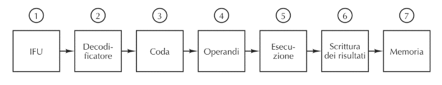

# Microarchitettura

- instruction:prende l'istruzione
- reset:fa il reset del program counter e fa ricomiciare il programma dall'inizio
- outM:è un bus che va in memoria

- Un **registro D** che contiene uno dei due operandi della ALU, e che può memorizzare
un precedente output
- Un **registro A** che può contenere un dato che fa parte delle istruzioni o un precedente output
- Il **secondo input della ALU** può essere o il contenuto del registro A oppure un dato proveniente dalla memoria
- E’ presente anche il **Program Counter** che, per quanto riguarda i salti, può essere impostato tramite il registro A
- Il registro A può essere anche usato come **puntatore alla memoria** (per operazioni di lettura/scrittura)
- Il flusso dei dati fra i vari componenti viene controllato tramite Mux 
- I **Mux ed i bit di controllo dei registri**, vengono gestiti da una microarchitettura composta da semplici circuiti combinatori
- Infatti, **l’intero ciclo Fetch-Decode-Execute del processore Hack viene eseguito in un solo ciclo** di clock, ed i segnali di controllo sono funzione dell’istruzione corrente
  - In altre parole, una istruzione in ingresso al tempo t, viene completamente eseguita entro il tempo t+1
  - Al tempo t+1 viene considerata l’istruzione successiva 

Il decode setta i c bit che vengono utilizzati come control bit per tutti gli altri componenti

## SRAM e DRAM

Le **SRAM** (Static RAM) sono realizzate tramite flip-flop come le memorie viste in precedenza  

- Veloci (ordine del nanosecondo)
- Usate principalmente per le cache

Le **DRAM** (Dynamic RAM) o SDRAM (Synchronous DRAM), usate per le memorie centrali, hanno un solo transistor ed un condensatore che mantiene (tramite carica elettrica) un singolo bit

- Visto che il condensatore perde la propria carica, deve essere ricaricato per evitare di perdere la propria informazione
- Si rendono necessarie periodiche fasi di “refresh” (ad intervalli dell’ordine del millisecondo)
  - A causa del refresh sono più lente (ordine della decina di nanosecondi)
  - Richiedendo un solo transistor costano meno e possono essere maggiormente miniaturizzate

## Cache

> La **cache memorizza gli ultimi dati utilizzati dalla cpu**, e se la cpu deve accedere dati che ha richiesto da poco la cache restituisce i dati molto velocemente evitando di andarli a riprendere dalla memoria .

I linguaggi di programmazione vengono compilati per utilizzare la cache,ma non la possono controllare.

Modello Cache di studio:  
- Una prima piccola cache (livello 1: L1) è direttamente nel chip della CPU separata fra istruzioni e dati (dimensioni fra 16-64 KB)
- Una seconda cache (livello 2: L2) nel medesimo “involucro” della CPU “unificata” fra dati e istruzioni (fra 512 KB ed 1 MB)
- Una terza cache (livello 3: L3) esterna alla CPU (alcuni MB)

La cache  è suddivisa in n righe ognuna che contiene m byte.  
Si procede suddividendo la memoria in blocchi da m byte e il blocco i andrà nella riga `i mod n`, la cache tiene traccia anche di quale specifico blocco contiene la linea.

### Esempio di Cache Direct Mapped

Immaginiamo ora una cache con n=2048 linee di dimensione m=32 byte:  
- **Valid**: indica se la linea di cache contiene un blocco, (all'inizio tutti i valid sono a false e data e tag hanno valori randomizzi)
- **Data**: contiene i 32 byte del blocco
- **Tag**: indica esattamente quale blocco è contenuto

quindi se abbiamo un indirizzi da 32 bit:  
- primi **5**: (meno significativi) indicano quale byte dei 32 byte stiamo cercando
- i successivi **11**: indicano quale linea della cache ($2^11$=2048)
- i rimanenti **16**: quale tra gli indirizzi che utilizzano quel blocco

  

  Esercizio
  
   

**indirizzo:**  
- primi 4 bit per l'indirizzo dentro data
- 3 bit per capire la cache
- 2 bit per il tag

locazioni e indirizzi
0:0-15,128-143.. 
1:16-31.. 
2:32-47.. 
3:48-63.. 
4:64-79.. 
5:80-95.. 
6:96-111.. 
7:112-127.. 

**esercizio**

locazione 12, non è nella cache 00 000 1100

| index  | valid | tag      | data     |
| ------ | ----- | ----     | ----     |
| 0      | 1     | 00       | val 0-15 |

locazione 14 è presente nella cache, 00 000 1110

| index  | valid | tag      | data     |
| ------ | ----- | ----     | ----     |
| 0      | 1     | 00       | val 0-15 |

locazione 22 non è presente nella cache  00 001 0110  

| index  | valid | tag      | data      |
| ------ | ----- | ----     | ----      |
| 0      | 1     | 00       | val 0-15  |
| 1      | 1     | 00       | val 16-32 |

locazione 130 non è presente è presente nella  cache, 01 000 0010

| index  | valid | tag      | data        |
| ------ | ----- | ----     | ----        |
| 0      | 1     | 01       | val 127-143 |
| 1      | 1     | 00       | val 16-32   |

locazione 24  è presente nella cache  00 001 1000  

| index  | valid | tag      | data        |
| ------ | ----- | ----     | ----        |
| 0      | 1     | 00000001 | val 127-143 |
| 1      | 1     | 00000000 | val 16-32   |

locazione 13, non è nella cache 00 000 1101

| index  | valid | tag      | data      |
| ------ | ----- | ----     | ----      |
| 0      | 1     | 00       | val 0-15  |
| 1      | 1     | 00000000 | val 16-32 |

### Gestione della cache

Quando si utilizza la cache ha:  
- **cache hit**: quando la cache ha successo
- **cache miss**: il contenuto nella cache dev'essere ricopiato in memoria, e sostituito con il nuovo blocco

Nei momenti in cui i dati sono in cache e non in memoria si possono creare delle anomalie, se più processori o più dispositivi accedono alla memoria centrale.

## Paginazione

> Sistema per lo **spostamento di dati** tra la memoria **centrale** e la memoria di **massa**

L'impaginazione è getsita dall'sistema operativo

## Pre-fetch delle istruzioni

Nell’architettura del nostro calcolatore Hack,  consideriamo due distinti ingressi per la CPU:  
- instruction: carica l’istruzione da eseguire da una specifica memoria programma
- inM: carica i dati necessari da una distinta memoria dati

>  Nelle architetture usuali (Von Neumann) dati e programmi risiedono nella stessa memoria

Il **Pre-fecth** delle istruini è il caricare la prossima istruzione mentre la precedente è in esecuzione.  
Questa è già un esempio di pipeline, ce ne sono di molto più complesse, anche a 7 stadi come quella sotto.

### PipeLine, Salti e registri

Per evitare di far lavorare il **processore inutilmente quando si ha un salto**, si usano varie tecniche come:  
- mettere **nop** dopo l'istruzione di salto in modo che non sprechi tempo finche non si sà dove eseguirà
- predire i salti usando **euristiche**, in particolare i salti all'indietro sono più comuni e in base hai salti fatti

Con la pipeline inoltre si possono avere dei problemi con i registri, infatti se **operazioni accedono agli stessi registri bisogna aspettare** che una abbia concluso con l'utilizzo del registro.