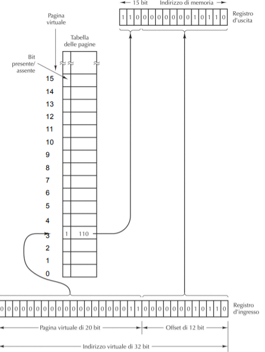
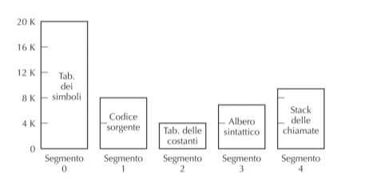
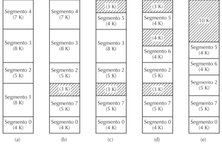
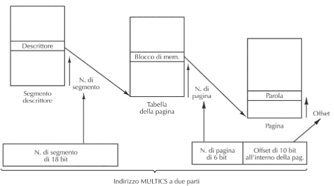
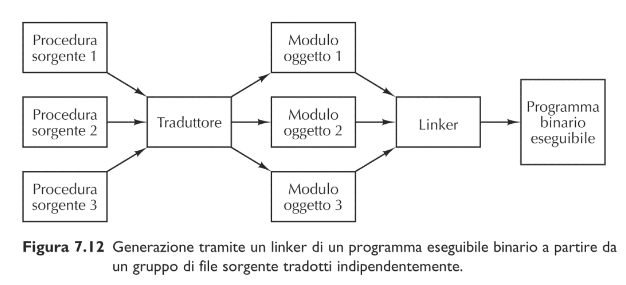
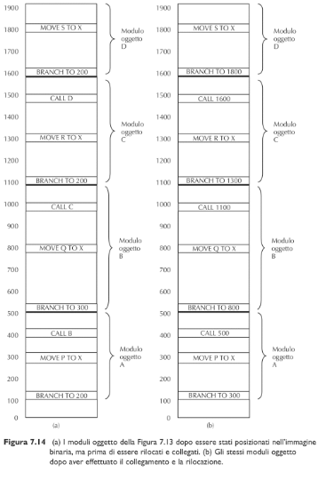
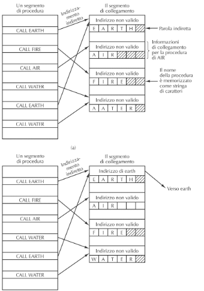

# Sistema Operativo

> Possiamo vedere il **sistema operativo** come **l’interfaccia fra il calcolatore ed i programmi applicativi**

Ha diversi compiti come:  
- Gestione della memoria
- Gestione dei processi
- Gestione delle periferiche I/O

## Paginazione

Il sistema opeartivo crea una mappatura tra gli indirizzi virtuali che vedono i processi, e quelli fisici della ram, così facendo i processi hanno l'lillusione di usare un unico ampio spazio di indirizzamento che coicide con la memoria virtuale.

Questa Memoria virtuale è divisa in Pagine di uguale dimensione che corrispodono ad una potenza di due, se la dimensione di pagina è $2^k$, si usano esattamente k bit per indirizzare una locazione alll'interno di una pagina

La memoria viene suddivisa in parti di medesima dimensione chiamate "blocchi di memoria"

Il MMU (memory managment unit) si occupa di tradurre un indirizzo virtuale nel corrispondente indirizzo reale, utilizza una tabella delle che indica se la tabella è in memoria e se è si, indica l'indirizzo del blocco reale e l'indirizzo del blocco virtuale.

> Working set: sono le pagine in memoria in un determiatao momento

Quando si accede ad una pagina che non è nel working set avviene una, page fault il gestore di trap toglie una pagina per liberare il blocco e inserici la nuova pagina.

## Algoritmi di paginazione

### LRU

Si rimove dall amemoria la pagina che da più tempo non viene utilizzata.

(più performante)

### FIFO

Si toglie la pagina che è stata inserita da più tempo

(più facile da implementare  e veloce nel processo)

## Dirty bit

Per evitare di riscrivere tutti i blocchi nella memoria secondaria, si utilizza la tecnica del dirty bit.

Ogni blocco ha associato un bit che viene settato a zero quando entra in memoria primaria, e viene posto a uno se vi è un accesso in lettura nel blocco.  
Quando blocco dovrà essere riscritto nella memoria secondaria se il dirty bit è a zero non viene ricopiato.

## Frammentazione interna

(questa tecnica è infefficente e non utilizzata)

**Frammentazione Intertna**(problema della paginazione): se un programma serve una quantità di memoria che non è un della pagina, l'ultima pagina non verrà utilizzata completamente

## Segmentazione

È come se ci fossero contemporaneamente utilizzabili tante diverse memorie, ognuna chiamata segmento. Questi segmenti sono visibili dal programmatore e ognuno ha dimensione diversa. 

Come nella paginazione tentiamo in memoria primaria solo i segmenti necessari (le operazioni di swapping però generano aree non utilizziate creando il fenomeno di "frammentazione esterna").
Questo però genera delle zone inutilizzata dette Lacune, che a volte rendono necessario compattare i sementi eliminando le lacune .
Per fare lo swap dei segmenti sono state ideate diverse tecniche:
- Best Fit: si inserisce nella lacuna più piccola ma sufficente per il segmento
- First Fit: si inserisce nel primo segmento in cui ci sta (più veloce) 

### Segmentazione e Paginazione

I segmenti vengono suddivisi in pagine; Si complica il MMU che deve tenere
- indicazione del segmento
- Indicazione della pagina
- Offset all’interno della pagina

## Linking

> Il linker "collega" più moduli oggetto in un eseguibile

Ogni modulo oggetto viene realizzato assumendo che il proprio spazio inizi da zero, quando vengono collegati si uniscono in un unico file, aggiornando tutti gli indirizzi interni (al file oggetti)(utilizzando il **dizionario di ricollocazione**) per gli indirizzi esterni il linker li collega.

## Collegamento dinamico

Alcune procedure, non vengono inserite nell'eseguibile, ma vengono collegate durante l'esecuzione

**Passi per il collegamento dinamico**:
- si compia con un indirizzo sbagliato (che quando è chiamato genera un trap)
- nel programma compilato si inserisce il nome della procedura che si desiderava invocare tramite link dinamico
- Per implementare il collegamento dinamico, si compila la chiamata con un indirizzo sbagliato che genera un treap,

Il collegamento dinamico viene utilizzato per una serie di procedure che vengono usate da tanti programmi diversi (dentro delle share library es. DLL),infatti occupano meno spazio nell'eseguibile ed è più facile aggiornarle e modifiarle

