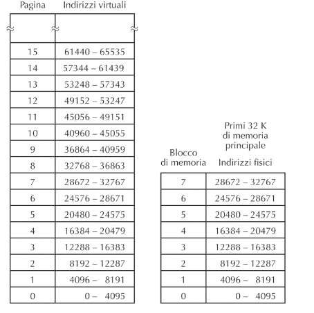

# Sistema Operativo

## Memoria Virtuale Storia

Negli anni 60 avevano un calcolatore con 4K e parole da 16bit, gli indirizzi fisici andavano da 0 a 4095; avendo una architettura a 16bit gli indirizzi da 4096 a 66535 non venivano utilizzati, così crearono la memoria virtuale, che utilizza tutti gli indirizzi da 0 a 65535.

## Paginazione 

> Memoria virtuale viene divisa in "pagine" di uguale dimensione

NOTA: se la pagina è di $2^k$ si useranno k bit per indirizzare una locazione all'interno di una pagina

Esempio

## Memory Management Unit

Il MMU si occupa di tradurre un indirizzo virtuale nel corrispondente indirizzo reale.

