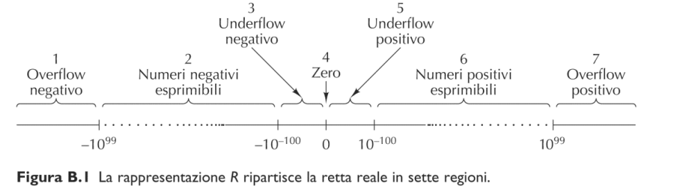

# 6. Rappresentazione dell'informazione

I calcolatori elaborano molti tipi di informazione come testi, immagini ,suoni ,numeri etc.. Nonostatne ciò le memorie dati possono contenere solo valori binari.

## 6.1. Numeri

Partiamo dai numeri naturali positivi che vengono rappresentati semplicemente in base 2.  

### 6.1.1. Modulo e segno

Moduloe segno si una l'ultimo bit come segno

> es
> usando 8 bit: 00000110=6, 10000110=-6

### 6.1.2. Complemento a 1

Complemento a 1: il bit più a sx indica il segno, ma se il numero è negativo il modulo viene complementato

>Es
> usando 8 bit: 00000110=6, 11111001=-6

### 6.1.3. Complemnto a 2

Complemento a 2: come per il complemento a 1, ma se il numero è negativo dopo il complemento si aggiunge 1

    

Esempio
    

usando 8 bit: 00000110=6, 11111010=-6

con questo metodo è più facile fare le addizzioni perchè riusciamo a farle con lo stesso metodo

con il complemento a 2 possiamo avere un range da $[2^{k-1}...2^{k-1}-1]$ dove k è il numero di bit

### 6.1.4. Codifica in eccesso

> La decodifica si ottiene applicando la decodifica 
standard e poi sottraendo $2^{k-1}$  al numero ottenuto

    

    esempio
    

00...00 rappresenta $-2^{k-1}$  
10...00 rappresenta $0$   
11...11 rappresenta $2^{k-1}$  

### 6.1.5. Numeri con la virgola

la rappresentazione dei numeri con la virgola si usano due numeri:
- f che è la mantissa
- e che è l'esponente

$n=f \times 10^{e}$

  

  esempio codifica
  

se la mantissa è tra 0,001 e 0,999
e l'esponente è tra 0 e 99

riesco a rappresentare i numeri

**notazione concreta**:
- utilizziamo la base 2
- come mantissa utilizziamo un numero minore di 1
- inoltre normalizziamo la mantissa (la cifra più significativa (dopo la virgola) non può essere uguale a zero)

  

esempio concreto
  

vogliamo rappresentare il numero 432:
la mantissa sarà 432=110110000b questo numero va normalizzato quindi dobbiamo shiftarlo, quindi gli diamo un esponente di: $2^9$

**standard binary32**:
- 1 bit di segno 
- 8 bit di esponente
- 23 bit di mantissa

  

Si converta il numero 0.3 in notazione floating point in base 2 normalizzata (usando il complemento a 2 su 8 bit sia per la mantissa che per l'esponente).
  

  TODO: da finire

la mantissa si legge moltiplicando il primo partendo da sinistra $2^-1$ fino a $2^-n$ nell'ultimo dove n sono il numero di bit, e per calcolare il numero in decimale va tutto moltiplicato per $2^{\text{esponente}}$

segno : 0 
mantissa: 10011001b
esponente: 1111111b

## UNICODE

## Codici corretti

Indipendentemente dal tipo di dati memorizzato occasionalmente le memorie sono soggette ad errori sia durante le operazioni di lettura che di scrittura.

analogamente nella trasmissione dei dati.

se una parola consiste di m bit se aggiungono r bit controllo ottenendo una parola a n=m+r bit

un codice è un meccanismo atto a determinare gli r bit di controllo relativi ad ogni parola di m bit.

### Distanza di Hamming

la distanza di hamming è la differenza di bit tra due stringhe di bit.(distanza perchè ha le proprietà matematiche della distanza)

**es**:
distanza tra 101110 e 110101 è 4

Per rilevare d  bit errati è necessario un codice con 
distanza di Hamming maggiore o uguale a d+1

