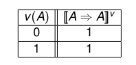
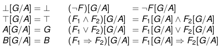

# Conseguenza Logica

## Conseguenza Logica e tabella di verità 
> $\Gamma \Vdash F$ (conseguenza logica) quando per ogni mondo v si ha che, $\llbracket  G\rrbracket^v=1$ per ogni $G \in \Gamma$, allora $\llbracket  F\rrbracket^v=1$

$\Gamma \Vdash F$  è rappresentabile con tabelle di verità, ma solo se $\Gamma$ è un insieme finito

## Tautologica e non 

> F è tautologica quando $\Vdash F$ (F è conseguenza logica dell'insieme vuoto)

esepio

la tabella ha soli uno

$A\implies A$

## Soddisfacibile e non

> F è soddisfacibile quando esiste un mondo v tale che $v \Vdash F$

esepio

la tabella ha almeno un uno

$\neg A$

> F è insoddisfacibile in un mondo v ($v \Vdash F$) sse $v(F)=1$

esempio

è insoddisfacibile se la tabella ha soli zero 

$A \wedge \neg A$

## Equivalenza e tabella di verità

F e G sono logicamente equivalenti $F \equiv G$ quando **le loro tabelle diverità sono identiche**

esempio

## Sostituzione

> Per Sostituire una formula G al posto di A in F scriviamo F[G/A]

> Teorema di invarianza per sostituzione: per tutte le formule $F,G_1,G_2$ e per ogni A, se $G_1 \equiv G_2$ allora $F[G1/A] \equiv F[G_2/A]$

TODO: chiedere ad angi