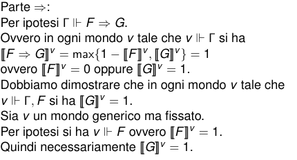
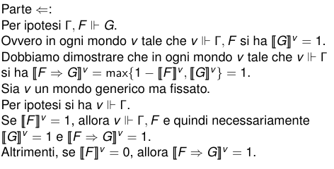
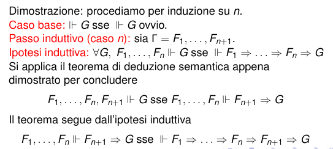

# Deduzione Semantica

## Teorema di deduzione semantica

**Deduzione semantica** per ogni formula F e G si ha $\Gamma \Vdash F \implies G \mbox{  sse  } \Gamma,F \Vdash G$

Dimostrazione

Si può dimostrare anche con n Formule ($F_1,..,F_n\Vdash G \mbox{ sse } \Vdash F_1 \implies .... \implies F_n \implies G$)

dimostrazione per induzione

>NOTA:grazie al torema di deduzione semantica, se le ipotesi sono un numero finito,**il concetto di conseguenza logica è riducibile a quello di tautologia** e viceversa

### Altri Teoremi

$\Vdash F \mbox{ sse } F\equiv \top$ (ovvio)  

$\Vdash F \mbox{ sse } \neg F\mbox{ è insoddifacibile}$  

$\Gamma \Vdash F \mbox{ sse } \Gamma, \neg F\mbox{ è insoddifacibile}$  

$\Gamma \mbox{ è isoddisfacibile sse } \Gamma \Vdash \bot$  

$\Gamma \mbox{ è soddisfacibile sse } \Gamma \nVdash \bot$  

$\neg F \equiv F \implies \bot$  

## Teoria di invarianza per Sostituzione

Una formaula può contenere più buchi, riempire un buco significa rimpiazzare la variabile con una formula.

esempio

$(A \vee A) [B \implies C/ A ]= (B \implies C) \wedge (B\implies C)$

> Teorema di invarianza per sostituzione, per tutte le formule F,$G_1$,$G_2$ e per ogni A se $G_1 \equiv G_2$ allora $F[G_1/A] \equiv F[G_2/A]$

Dimostrazione per induzione strutturale su F.
TODO