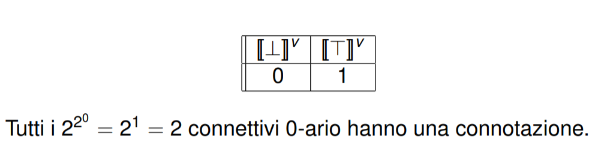
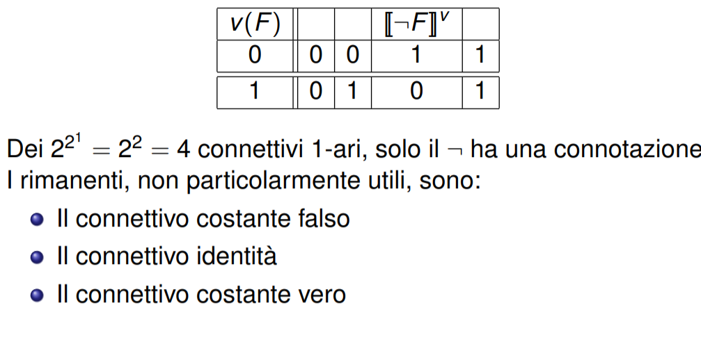
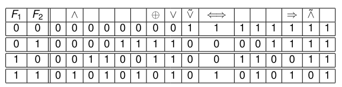
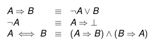
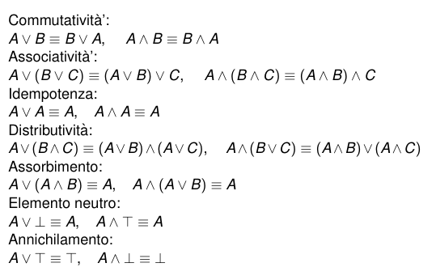
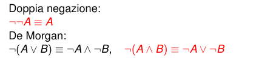

# Connettivi della logica proporzionale classica

## Connettivi Logici

Un connettivo n-ario, viene definito da una tabella di verità con $2^n$ righe.

Quindi possiamo dire che è una funzione $f:\{0,1\}^n\to \{0,1\}$

Quanti connettivi n-ari distinti esistono? 

$2^{2^n}$

## Operatori 0-ari 

## Operatori 1-ari 

## Operatore 2-ari

## Riduzione tra Connettivi

è possibile esprimere un connettivo logico usandone altri e l'equivalenza logica

es

### Connettivi ridondanti

Definizione: un insieme di connettivi è ridondante se contiene un connettivo riducibile ai restanti

### Funzionalmente Completo

Definizione: un insieme di connettivi è funzionalmente completo se ogni altro connettivo e riducibile a questi 

## Insiemi funzionalmente completi

Esistono insiemi funzionalmente completi come $\{\vee,\wedge,\bot,\top,\neg\}$ (è ridondante per $\bot\equiv A \wedge \neg A$)

Qual'è l'insieme funzionalmente completo con cardinalità minima (l'esempio prima è ridondante), l'insieme $\{\vee,\neg\}$ è funzionalmente completo e non ridondante

## Scelta dei connettivi

La scelta è un compromesso fra l’esigenza di considerare
un insieme piccolo (ma funzionalmente completo) e un
insieme che permetta di catturare naturalmente,
direttamente espressioni del linguaggio naturale

## Equivalenze logiche notevoli

