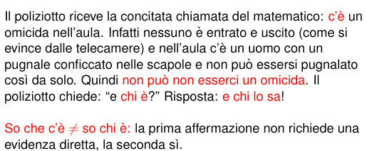
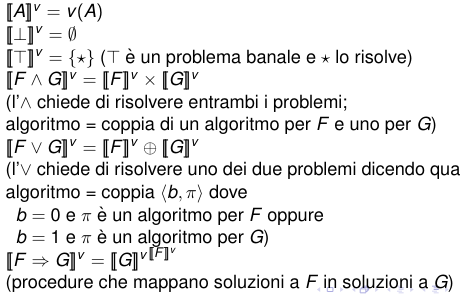
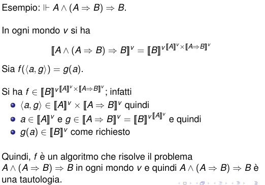

# Logica intuizionista

> **Semantica intuizionista** (non c'è la verità platonica classica) semantica dell'evidenza, della conoscenza diretta, della calcolabilità

## Evidenze dirette e indirette

Esempio

**in logica classica**: $\exists x.P(x)$ significa "so che c'è un x t.c $P(x)$"  
**in logica intuizionista**: $\exists x.P(x)$ significa "so che chi è quell' x t.c $P(x)$"  

Tutte le prove **intuizioniste** di $\forall i. \exists o.P(i,o)$ contengono un algoritmo per calcolare o a partire da i .

paradosso di Banach

è un teorema classico che non si può dimostrare con la logica intuizionista.

prendete una sfera piena la riempiamo di punti, è possibile tre insiemi di punti in cui posso partizionare la mia sfera.
roteando e traslando questi punti con movimenti rigidi, posso creare due sfere con gli stessi punti e uguali.

## Modello Classico

Nella semantica classica:
- il valore di verità di ogni enunciato è sempre determinato
- il valore di verità di ogni enunciato è immutabile

## Semantiche intuizioniste

###  Kripke
- Semantica alla **Kripke** (o dei mondi possibili)
    - l'insieme delle denotazioni è {0,1} ma 1significa vero, e con 0 significa Ignoto, il falso si ha quando $\neg A$ vale 1
   
### Brouwer Heyting

Semantica di **Brouwer Heyting**  
- Insieme vuoto = assenza di algoritmi = falsità
- Insieme non vuoto = almeno un algoritmi = verità

**Semantica**:

implica: F è un algoritmo che pracchiude anche G

esempio

$\neg F \equiv  F \implies \bot=$
$\llbracket \bot\rrbracket^{\llbracket F\rrbracket^v}=\llbracket \emptyset\rrbracket^{\llbracket F\rrbracket^v}=\begin{cases}\{\emptyset\} & \mbox{ se } \llbracket F \rrbracket ^v = \emptyset \\  \emptyset & \mbox{ se } \llbracket F \rrbracket ^v \neq \emptyset \end{cases}$

**teorema di compattezza**: se esiste una conseguenza logica a partire da un insieme infinito di ipotesi, solo se esiste un insieme $\delta$ sottiinsieme di Gamma per cui vale la conseguenza logica F conseguenza logica di delta   	

