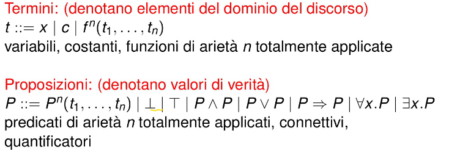

# Logica di prim'ordine

> Logica di prim0ordine è molto utilizzata dai matematici

la **Logica proposizionale** è quella logica le cui connotazioni denotano tutte valori di verità, è molto limitata quando si si sposta su **oggetti infiniti** ( **non cattura i quantificatori **, dicono quanto sia esteso l'insieme degli oggetti che soddisfa un predicato)

## Quantificatori

- esiste  $\exists$
- per ogni $\forall$

I quantificatori sono **utilizzati sugli elementi** del dominio, **non** sono utilizzabili su **funzioni e predicati**

## Definizione della Sintassi

Oltre ai quantificatori definiamo:
- variabili: denotano un oggetto ignoto e variabile sul dominio (es x,y,z..)
- constanti: denotano un oggetto noto e fissato del dominio (es 1,0,$\pi$,...)
- simboli di funzione: applicati a connotazioni di oggetti del dominio denotano un oggetto del dominio (es +,*,il fratello di ...)
- simboli di predicato: applicati a connotazioni di oggetti del dominio denotano un valore di verità (es $<,le,=,...$)

