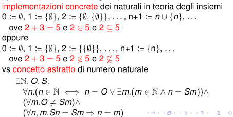
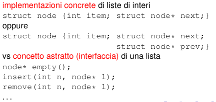

# Astrazione in matematica e informatica

## Introduzione

Mentre la matematica ha avuto millenni in cui si è sviluppato un modello di astrzione e generalizzazione.

Mentre nell'informatica si stanno provando più modi di astrzione e generallizazione ma non si è ancrora arrivati ad uno senza problemi logici

## Astrazione e Generalizzazione

> Processo tipico della matematica che permette di definire enti, concetti o procedure matematiche, estraendo e isolando alcune caratteristiche comuni a pi `u oggetti e trascurandone altre

esempio matematica

esempio informatica

> Generalizzare significa prendere una definizione o una
relazione che si applica a certi casi, e definirla in un nuovo modo tale che nei casi di prima dia gli stessi risultati, però si applichi anche ad altri casi.

### Benefici dell'astrazione e generalizzazione

1. Riuso: le buone generalizzazioni si applicano moltissime volte 
2. Chiarezza: le generalizzazioni catturano concetti di alto livello
3. Decoupling: attraverso astrazione e generalizzazione è possibile fare in modo che la chiarezza di una parete non dipena dall'implementazione di un altra
4. Correttezza: l’alternativa al riuso è il cut&paste che può  propagare errori, da correggere poi in tutte le copie, e introdurre errori quando il codice viene riusato ove non valgano gli stessi invarianti sui dati

## Tesi di Church-Turing

> Qualunque problema di calcolo risolvibile da un linguaggio di programmazione general-purpose lo `e da qualunque altro linguaggio general-purpose

## Strutture Algebriche

